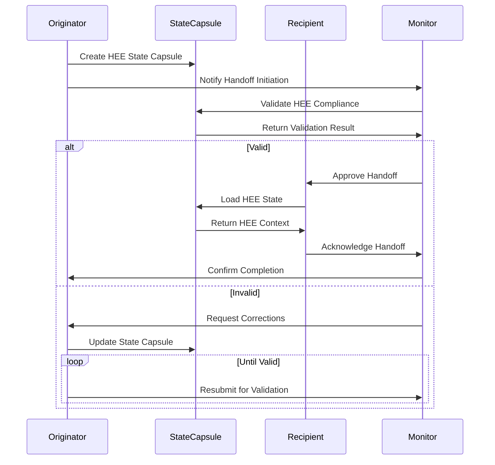

# Agent State Handoff Protocol for Human Execution Engine (HEE)

## Overview

This document defines the comprehensive protocol for agent state handoffs within the Human Execution Engine (HEE) ecosystem, ensuring seamless transitions between agents while preserving critical state, decisions, and context.

## Core Principles

### 1. HEE Handoff Requirements

**Mandatory Requirements**:
- **State Preservation**: All HEE state must be preserved across agent transitions
- **Decision Continuity**: All HEE decisions must be maintained and accessible
- **Context Stability**: HEE execution context must remain stable
- **Governance Compliance**: All handoffs must comply with HEE governance rules

### 2. HEE Agent Roles

| Agent Role | Responsibilities | Handoff Requirements |
| ---------- | --------------- | -------------------- |
| Originator | Initiates handoff | Create comprehensive state capsule |
| Recipient  | Continues work   | Validate and acknowledge state capsule |
| Monitor    | Oversees process | Ensure HEE compliance and quality |

## Handoff Protocol

### 1. HEE Handoff Workflow



### 2. HEE State Capsule Requirements

**Minimum Viable Handoff Capsule**:
```yaml
chat: HEE [Project] Agent Handoff [Originator]→[Recipient]
purpose: Preserve HEE state and context for agent transition
context:
  - Project: [HEE Project Name]
  - Current Phase: [Phase/Milestone]
  - HEE State Version: [Version]
  - Originator Agent: [Agent ID]
  - Recipient Agent: [Agent ID]
  - Handoff Timestamp: [ISO 8601]
  - HEE Governance Compliance: [Status]

decisions:
  - [Critical decisions made during originator's session]
  - [HEE-specific decisions with rationale]
  - [Architectural choices and impact]

open_threads:
  - [Unresolved issues requiring recipient attention]
  - [HEE-specific pending tasks]
  - [Dependencies and blockers]

next_chat_bootstrap:
  - [Immediate next steps for recipient]
  - [HEE execution continuation instructions]
  - [Priority-ordered task list]
```

## HEE-Specific Handoff Requirements

### 1. State Preservation Requirements

**HEE State Components**:
- Execution context and environment state
- Decision history and rationale
- Open threads and priorities
- HEE governance and quality metrics
- Prompt compatibility and versioning

**HEE Validation Checklist**:
- [ ] All HEE decisions preserved with rationale
- [ ] HEE execution context documented
- [ ] HEE state version compatibility verified
- [ ] HEE governance compliance confirmed
- [ ] HEE quality metrics included

### 2. Decision Continuity Requirements

**HEE Decision Tracking**:
- All decisions must include HEE impact analysis
- Decision rationale must reference HEE principles
- Follow-up requirements must be HEE-compliant
- Decision chains must be preserved

**HEE Decision Format**:
```yaml
decisions:
  - Decision: [Decision Text]
    Rationale: [HEE Alignment Explanation]
    Impact: [HEE System Impact]
    Follow-up: [Next Steps]
    HEE Compliance: [Governance Reference]
```

## Handoff Execution

### 1. Originator Responsibilities

**HEE Originator Checklist**:
- [ ] Create comprehensive HEE state capsule
- [ ] Document all HEE decisions with rationale
- [ ] List all HEE open threads and priorities
- [ ] Define HEE-compliant next steps
- [ ] Validate HEE governance compliance
- [ ] Notify HEE monitor of handoff initiation
- [ ] Provide HEE-specific transition instructions

**HEE Originator Commands**:
```bash
# Create HEE handoff capsule
python scripts/create_hee_handoff.py \
  --originator [Agent ID] \
  --recipient [Agent ID] \
  --project [Project] \
  --output docs/STATE_CAPSULES/$(date +%Y-%m-%d)/HEE-Handoff-[ID].md

# Validate HEE handoff capsule
python scripts/validate_hee_handoff.py \
  --input HEE-Handoff-[ID].md \
  --hee-rules strict
```

### 2. Recipient Responsibilities

**HEE Recipient Checklist**:
- [ ] Load and validate HEE state capsule
- [ ] Acknowledge HEE decision continuity
- [ ] Assess HEE open threads and priorities
- [ ] Execute HEE next steps in order
- [ ] Maintain HEE governance compliance
- [ ] Update HEE state capsule as needed
- [ ] Notify HEE monitor of handoff completion

**HEE Recipient Commands**:
```bash
# Load HEE handoff capsule
python scripts/load_hee_handoff.py \
  --input docs/STATE_CAPSULES/2026-01-24/HEE-Handoff-[ID].md \
  --acknowledge

# Continue HEE execution
python scripts/continue_hee_execution.py \
  --state-capsule HEE-Handoff-[ID].md \
  --next-step [Step Number]
```

### 3. Monitor Responsibilities

**HEE Monitor Checklist**:
- [ ] Validate HEE handoff capsule structure
- [ ] Verify HEE governance compliance
- [ ] Confirm HEE quality discipline adherence
- [ ] Approve or reject handoff based on HEE rules
- [ ] Monitor HEE execution continuity
- [ ] Document HEE handoff metrics
- [ ] Escalate HEE compliance issues

**HEE Monitor Commands**:
```bash
# Validate HEE handoff compliance
python scripts/validate_hee_compliance.py \
  --handoff HEE-Handoff-[ID].md \
  --hee-rules strict \
  --output compliance_report.json

# Approve HEE handoff
python scripts/approve_hee_handoff.py \
  --handoff HEE-Handoff-[ID].md \
  --monitor [Monitor ID] \
  --timestamp $(date +%Y-%m-%dT%H:%M:%S%z)
```

## HEE Handoff Scenarios

### 1. Standard HEE Agent Transition

**Scenario**: Planned transition between HEE agents

**HEE Workflow**:
1. Originator completes current task
2. Originator creates HEE handoff capsule
3. Monitor validates HEE compliance
4. Recipient acknowledges and continues
5. Monitor confirms successful transition

**HEE Example**:
```yaml
chat: HEE CI Monitoring Agent Handoff A→B
purpose: Transition CI monitoring integration from Agent A to Agent B
context:
  - Project: HEE CI Monitoring Integration
  - Current Phase: Pattern adaptation complete
  - HEE State Version: state-v2
  - Originator Agent: HEE-Agent-A-v1.2.3
  - Recipient Agent: HEE-Agent-B-v1.2.3
  - Handoff Timestamp: 2026-01-24T14:30:00Z
  - HEE Governance Compliance: Validated

decisions:
  - Adapted MT monitoring patterns to HEE state format
    Rationale: Ensures HEE compatibility
    Impact: Full HEE integration capability
    HEE Compliance: State preservation rules
  - Implemented HEE safety protocols in auto-fix
    Rationale: Maintains HEE quality discipline
    Impact: Safe HEE operations
    HEE Compliance: Quality gates

open_threads:
  - Test HEE state preservation with monitoring patterns
  - Document HEE integration guide
  - Verify HEE spec coverage metrics

next_chat_bootstrap:
  - Test HEE state preservation scenarios
  - Create HEE integration documentation
  - Validate HEE monitoring patterns
```

### 2. HEE Emergency Handoff

**Scenario**: Unplanned transition due to agent failure

**HEE Emergency Protocol**:
1. Monitor detects agent failure
2. Monitor creates emergency HEE state backup
3. Monitor initiates emergency handoff
4. Recipient loads emergency state
5. Monitor validates HEE integrity

**HEE Emergency Commands**:
```bash
# Create emergency HEE backup
python scripts/create_hee_emergency_backup.py \
  --failed-agent [Agent ID] \
  --output emergency_backup.json

# Initiate emergency handoff
python scripts/initiate_hee_emergency_handoff.py \
  --backup emergency_backup.json \
  --recipient [Agent ID] \
  --priority critical
```

### 3. HEE Cross-Project Handoff

**Scenario**: Transition between HEE projects or ecosystems

**HEE Cross-Project Requirements**:
- Cross-project state compatibility
- Ecosystem decision preservation
- Inter-project dependency tracking
- Unified HEE governance compliance

**HEE Cross-Project Example**:
```yaml
chat: HEE Cross-Project Handoff MT→tick
purpose: Transition from MT-logo-render to tick-task integration
context:
  - Origin Project: MT-logo-render v1.2.0
  - Target Project: tick-task v1.1.5
  - HEE State Version: state-v2 (compatible)
  - Originator Agent: HEE-MT-Agent-v1.2.3
  - Recipient Agent: HEE-tick-Agent-v1.1.8
  - HEE Governance Compliance: Cross-project validated

decisions:
  - Completed MT-logo-render CI monitoring integration
    Rationale: MT-specific patterns adapted
    Impact: MT HEE compatibility achieved
    HEE Compliance: Cross-project rules
  - Prepared for tick-task release integration
    Rationale: tick-task dependencies identified
    Impact: Smooth transition to release phase
    HEE Compliance: Ecosystem governance

open_threads:
  - Integrate tick-task release patterns
  - Adapt HEE monitoring to tick-task workflows
  - Verify cross-project state compatibility

next_chat_bootstrap:
  - Analyze tick-task release requirements
  - Adapt HEE patterns to tick-task ecosystem
  - Test cross-project state preservation
```

## HEE Handoff Validation

### 1. HEE Compliance Validation

**HEE Validation Criteria**:
- State capsule structure compliance
- HEE governance rule adherence
- Quality discipline requirements
- Decision preservation completeness
- Execution continuity readiness

**HEE Validation Script**:
```bash
# Comprehensive HEE handoff validation
python scripts/validate_hee_handoff.py \
  --input HEE-Handoff-[ID].md \
  --checklist full \
  --hee-rules strict \
  --output validation_report.json
```

### 2. HEE Quality Metrics

**HEE Handoff Quality Metrics**:

| Metric                     | Target       | Measurement Method |
| -------------------------- | ------------ | ------------------ |
| State Preservation         | 100%         | Capsule validation |
| Decision Continuity        | 100%         | Decision tracking  |
| Context Stability          | 100%         | Context validation |
| Governance Compliance      | 100%         | Rule validation    |
| Execution Readiness        | 100%         | Next-step validation |

## HEE Handoff Monitoring

### 1. HEE Monitoring Requirements

**HEE Monitoring Metrics**:
- Handoff success rate
- State preservation integrity
- Decision continuity accuracy
- Execution continuity efficiency
- Governance compliance rate

**HEE Monitoring Dashboard**:
```json
{
  "handoff_metrics": {
    "total_handoffs": 42,
    "success_rate": "98%",
    "average_time": "12 seconds",
    "state_integrity": "100%",
    "compliance_rate": "100%"
  },
  "current_handoffs": [
    {
      "id": "HEE-20260124-001",
      "originator": "HEE-Agent-A",
      "recipient": "HEE-Agent-B",
      "status": "completed",
      "timestamp": "2026-01-24T14:30:00Z",
      "compliance": "validated"
    }
  ]
}
```

### 2. HEE Monitoring Commands

```bash
# Monitor HEE handoff status
python scripts/monitor_hee_handoffs.py \
  --status active \
  --output dashboard.json

# Generate HEE handoff report
python scripts/generate_hee_handoff_report.py \
  --period daily \
  --output handoff_report.md
```

## HEE Handoff Recovery

### 1. HEE Recovery Procedures

**HEE Recovery Scenarios**:

| Scenario                | Recovery Procedure |
| ----------------------- | ------------------ |
| Invalid state capsule   | Rollback to previous valid state |
| Decision continuity gap | Manual decision reconstruction |
| Context instability     | Emergency context restoration |
| Governance violation    | Compliance correction workflow |

**HEE Recovery Commands**:
```bash
# Rollback to previous HEE state
python scripts/rollback_hee_state.py \
  --current invalid.md \
  --previous valid.md \
  --output recovered.md

# Reconstruct HEE decisions
python scripts/reconstruct_hee_decisions.py \
  --input partial.md \
  --reference full.md \
  --output reconstructed.md
```

### 2. HEE Recovery Validation

**HEE Recovery Checklist**:
- [ ] State integrity restored
- [ ] Decision continuity verified
- [ ] Context stability confirmed
- [ ] Governance compliance validated
- [ ] Execution readiness approved

## Future HEE Handoff Enhancements

### 1. HEE Automation Roadmap

- **Phase 1**: Automated HEE handoff validation
- **Phase 2**: AI-assisted HEE state preservation
- **Phase 3**: Predictive HEE handoff optimization
- **Phase 4**: Autonomous HEE agent transitions

### 2. HEE Advanced Features

- HEE handoff versioning and diffing
- Cross-handoff dependency tracking
- Automated HEE decision extraction
- Real-time HEE state synchronization

### 3. HEE Research Areas

- HEE handoff pattern recognition
- Cross-agent context mapping
- HEE handoff performance optimization
- Autonomous HEE governance compliance

## Appendix: HEE Handoff Command Reference

### HEE Handoff Commands

```bash
# Create standard HEE handoff
python scripts/create_hee_handoff.py \
  --originator HEE-Agent-A \
  --recipient HEE-Agent-B \
  --project "CI Monitoring" \
  --phase "Integration" \
  --output docs/STATE_CAPSULES/$(date +%Y-%m-%d)/HEE-Handoff-A-B.md

# Validate HEE handoff
python scripts/validate_hee_handoff.py \
  --input HEE-Handoff-A-B.md \
  --hee-rules strict \
  --output validation.json

# Execute HEE handoff
python scripts/execute_hee_handoff.py \
  --handoff HEE-Handoff-A-B.md \
  --monitor HEE-Monitor-1 \
  --timestamp $(date +%Y-%m-%dT%H:%M:%S%z)
```

### HEE Emergency Commands

```bash
# Create emergency HEE handoff
python scripts/create_hee_emergency_handoff.py \
  --failed-agent HEE-Agent-A \
  --recipient HEE-Agent-B \
  --priority critical \
  --output emergency_handoff.md

# Recover failed HEE handoff
python scripts/recover_hee_handoff.py \
  --failed failed_handoff.md \
  --backup backup.json \
  --output recovered_handoff.md
```

This HEE Agent State Handoff Protocol provides a comprehensive framework for seamless agent transitions within the Human Execution Engine ecosystem, ensuring state preservation, decision continuity, and governance compliance across all HEE operations.
