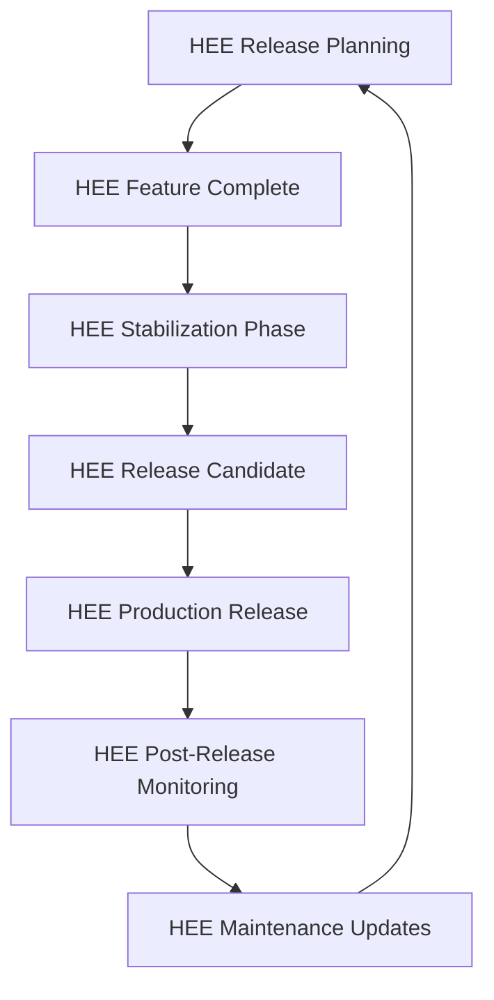

# HEE Release Preparation Protocol

## Overview

This document provides comprehensive guidance for preparing Human Execution Engine (HEE) releases, integrating best practices from tick-task's operations framework and adapting them to HEE's architecture and principles.

## Core Principles

### 1. HEE Release Philosophy

**HEE-Specific Principles**:
- **Spec-First Releases**: Release specifications precede all implementation
- **State-Preserving Releases**: All releases maintain HEE state integrity
- **Decision-Driven Process**: Release decisions documented and preserved
- **Governance-Compliant Process**: All releases comply with HEE governance rules

### 2. HEE Release Roles

| Role | Responsibilities | HEE Requirements |
| ---- | --------------- | ---------------- |
| Release Manager | Oversees HEE release process | HEE governance compliance |
| Quality Assurance | Validates HEE release quality | HEE quality discipline |
| Documentation | Maintains HEE release docs | HEE spec coverage |
| State Manager | Preserves HEE state integrity | HEE state capsule management |

## HEE Release Process

### 1. HEE Release Workflow



### 2. HEE Release State Capsule Structure

```yaml
chat: HEE v[Version] Release Preparation
purpose: Document HEE release state, decisions, and preparation status
context:
  - Project: Human Execution Engine v[Version]
  - Release Type: [Major/Minor/Patch]
  - Current Phase: [Planning/Feature Complete/Stabilization/RC/Production]
  - HEE State Version: [state-vX]
  - HEE Governance Compliance: [Status]
  - HEE Quality Metrics: [Status]
  - Dependencies: [HEE Core, HEE Modules, External]

decisions:
  - [HEE release decisions with rationale]
  - [HEE architectural choices]
  - [HEE compatibility decisions]
  - [HEE governance decisions]

open_threads:
  - [HEE release blocking issues]
  - [HEE quality gate failures]
  - [HEE documentation gaps]
  - [HEE state migration requirements]

next_chat_bootstrap:
  - [HEE immediate next steps]
  - [HEE release validation tasks]
  - [HEE documentation updates]
  - [HEE state capsule finalization]
```

## HEE Release Phases

### 1. HEE Planning Phase

**HEE Planning Requirements**:
- HEE release specifications documented
- HEE state capsule structure defined
- HEE governance compliance plan
- HEE quality discipline requirements

**HEE Planning Checklist**:
- [ ] HEE release specs documented
- [ ] HEE state version compatibility verified
- [ ] HEE governance rules identified
- [ ] HEE quality metrics defined
- [ ] HEE release timeline established

### 2. HEE Feature Complete Phase

**HEE Feature Complete Criteria**:
- All HEE planned features implemented
- 100% HEE spec coverage achieved
- HEE state capsule integration complete
- HEE documentation drafts available

**HEE Feature Complete Checklist**:
- [ ] HEE feature implementation complete
- [ ] HEE spec coverage at 100%
- [ ] HEE state capsules created
- [ ] HEE documentation drafts ready
- [ ] HEE integration testing passed

### 3. HEE Stabilization Phase

**HEE Stabilization Activities**:
- HEE bug fixing and edge case handling
- HEE performance optimization
- HEE security hardening
- HEE state capsule validation

**HEE Stabilization Checklist**:
- [ ] HEE bug fixes completed
- [ ] HEE performance benchmarks met
- [ ] HEE security review passed
- [ ] HEE state capsules validated
- [ ] HEE quality gates passed

### 4. HEE Release Candidate Phase

**HEE RC Process**:
1. HEE version tagging with state references
2. HEE release candidate build generation
3. HEE comprehensive testing
4. HEE state capsule validation and signing

**HEE RC Checklist**:
- [ ] HEE version tagged with state references
- [ ] HEE RC build generated
- [ ] HEE testing completed
- [ ] HEE state capsules signed
- [ ] HEE documentation finalized

### 5. HEE Production Release Phase

**HEE Production Steps**:
1. HEE final state capsule generation
2. HEE cryptographic signing
3. HEE Git tag creation
4. HEE GitHub release creation
5. HEE distribution channel updates

**HEE Production Checklist**:
- [ ] HEE final state capsule generated
- [ ] HEE artifacts signed
- [ ] HEE Git tags created
- [ ] HEE GitHub release created
- [ ] HEE distribution updated

## HEE Release Validation

### 1. HEE Quality Gates

**HEE Quality Metrics**:

| Metric | HEE Target | Current | Status |
| ------ | ---------- | ------- | ------ |
| Spec Coverage | 100% | [Value]% | [Pass/Fail] |
| State Preservation | 100% | [Value]% | [Pass/Fail] |
| Test Coverage | 100% | [Value]% | [Pass/Fail] |
| Security Vulnerabilities | 0 critical | [Value] | [Pass/Fail] |
| HEE Governance Compliance | 100% | [Value]% | [Pass/Fail] |

**HEE Validation Commands**:
```bash
# Validate HEE release readiness
python scripts/validate_hee_release.py \
  --state-capsule release.json \
  --checklist full \
  --hee-rules strict

# Generate HEE release validation report
python scripts/generate_hee_validation_report.py \
  --version v1.2.3 \
  --output validation_report.md
```

### 2. HEE State Capsule Validation

**HEE State Validation**:
- HEE state version compatibility
- HEE decision preservation
- HEE context stability
- HEE governance compliance

**HEE State Validation Command**:
```bash
# Validate HEE release state capsule
python scripts/validate_hee_state_capsule.py \
  --input docs/STATE_CAPSULES/2026-01-24/HEE-v1.2.3-Release.md \
  --hee-rules strict \
  --release-mode
```

## HEE Release Documentation

### 1. HEE Changelog Requirements

**HEE Changelog Structure**:
```markdown
# HEE Changelog

## [1.2.3] - 2026-01-24
### Added
- [HEE new features]
- [HEE new integrations]

### Changed
- [HEE changed behaviors]
- [HEE updated components]

### Fixed
- [HEE bug fixes]
- [HEE issue resolutions]

### Security
- [HEE security updates]
- [HEE vulnerability fixes]

### HEE Specific
- [HEE state capsule updates]
- [HEE governance changes]
- [HEE quality improvements]

### Migration
- [HEE migration guides]
- [HEE breaking changes]
- [HEE compatibility notes]
```

### 2. HEE Documentation Requirements

**HEE Documentation Checklist**:
- [ ] HEE user guide updated
- [ ] HEE developer guide updated
- [ ] HEE API reference updated
- [ ] HEE state capsule documentation
- [ ] HEE release notes finalized
- [ ] HEE migration guides included

## HEE Release Packaging

### 1. HEE Package Structure

```
hee-release-v[Version]/
├── bin/                    # HEE executables
├── lib/                    # HEE libraries
├── prompts/                # HEE canonical prompts
├── docs/                   # HEE documentation
│   ├── USER_GUIDE.md       # HEE user documentation
│   ├── DEVELOPER_GUIDE.md  # HEE developer documentation
│   ├── API_REFERENCE.md    # HEE API documentation
│   └── STATE_CAPSULES/     # HEE release state capsules
├── scripts/                # HEE utility scripts
├── config/                 # HEE configuration templates
└── LICENSE                 # HEE license information
```

### 2. HEE Packaging Commands

```bash
# Create HEE release package
python scripts/create_hee_release_package.py \
  --version v1.2.3 \
  --output dist/hee-release-v1.2.3/ \
  --state-capsule docs/STATE_CAPSULES/2026-01-24/HEE-v1.2.3-Release.md

# Validate HEE package structure
python scripts/validate_hee_package.py \
  --input dist/hee-release-v1.2.3/ \
  --hee-rules strict
```

## HEE Release Deployment

### 1. HEE Deployment Checklist

**HEE Deployment Requirements**:
- [ ] HEE package validation completed
- [ ] HEE state capsules verified
- [ ] HEE governance compliance confirmed
- [ ] HEE quality metrics validated
- [ ] HEE documentation published
- [ ] HEE distribution channels updated

### 2. HEE Deployment Commands

```bash
# Deploy HEE release to GitHub
gh release create v1.2.3 \
  --title "HEE v1.2.3 Release" \
  --notes-file RELEASE_NOTES.md \
  --target main \
  --draft

# Publish HEE release
gh release edit v1.2.3 \
  --draft=false \
  --latest

# Upload HEE release assets
gh release upload v1.2.3 \
  dist/hee-release-v1.2.3.zip \
  docs/STATE_CAPSULES/2026-01-24/HEE-v1.2.3-Release.md
```

## HEE Post-Release Process

### 1. HEE Post-Release Monitoring

**HEE Monitoring Requirements**:
- HEE health monitoring
- HEE error tracking
- HEE performance metrics
- HEE user feedback analysis

**HEE Monitoring Commands**:
```bash
# Monitor HEE release health
python scripts/monitor_hee_release.py \
  --version v1.2.3 \
  --state-capsule docs/STATE_CAPSULES/2026-01-24/HEE-v1.2.3-PostRelease.md \
  --alert-threshold high

# Generate HEE post-release report
python scripts/generate_hee_post_release_report.py \
  --version v1.2.3 \
  --output post_release_report.md
```

### 2. HEE Maintenance Process

**HEE Maintenance Checklist**:
- [ ] HEE health checks daily
- [ ] HEE performance reviews weekly
- [ ] HEE security patches monthly
- [ ] HEE feature updates quarterly

## HEE Release Rollback

### 1. HEE Rollback Procedures

**HEE Rollback Triggers**:
- HEE critical failures in production
- HEE security vulnerabilities discovered
- HEE state corruption detected
- HEE governance violations identified

**HEE Rollback Commands**:
```bash
# Initiate HEE rollback
python scripts/initiate_hee_rollback.py \
  --current-version v1.2.3 \
  --target-version v1.2.2 \
  --state-capsule docs/STATE_CAPSULES/2026-01-24/HEE-Rollback.md \
  --priority critical

# Execute HEE rollback
python scripts/execute_hee_rollback.py \
  --rollback-plan rollback_plan.json \
  --state-capsule current.json \
  --output rollback_results.md
```

### 2. HEE Rollback Validation

**HEE Rollback Checklist**:
- [ ] HEE state integrity restored
- [ ] HEE decision continuity verified
- [ ] HEE context stability confirmed
- [ ] HEE governance compliance validated
- [ ] HEE execution readiness approved

## HEE Release Governance

### 1. HEE Compliance Requirements

**HEE Compliance Matrix**:

| Requirement | HEE Status | Validation Method |
| ----------- | ---------- | ----------------- |
| Spec-First Discipline | Required | HEE spec validation |
| State Preservation | Required | HEE capsule validation |
| Quality Discipline | Required | HEE quality gate checks |
| Governance Compliance | Required | HEE rule validation |
| Release Documentation | Required | HEE completeness check |

### 2. HEE Governance Validation

**HEE Governance Commands**:
```bash
# Validate HEE release governance
python scripts/validate_hee_release_governance.py \
  --release v1.2.3 \
  --state-capsule release.json \
  --output governance_report.json

# Generate HEE compliance report
python scripts/generate_hee_compliance_report.py \
  --version v1.2.3 \
  --output compliance_report.md
```

## Future HEE Release Enhancements

### 1. HEE Release Automation Roadmap

- **Phase 1**: HEE automated release validation
- **Phase 2**: HEE AI-assisted release planning
- **Phase 3**: HEE predictive release quality
- **Phase 4**: HEE autonomous release management

### 2. HEE Advanced Features

- HEE release versioning and diffing
- HEE cross-release dependency tracking
- HEE automated release documentation
- HEE real-time release monitoring

### 3. HEE Research Areas

- HEE release pattern recognition
- HEE cross-release impact analysis
- HEE release performance optimization
- HEE autonomous governance compliance

## Appendix: HEE Release Command Reference

### HEE Release Preparation

```bash
# Generate HEE release state capsule
python scripts/generate_hee_release_capsule.py \
  --version v1.2.3 \
  --type minor \
  --output docs/STATE_CAPSULES/$(date +%Y-%m-%d)/HEE-v1.2.3-Release.md

# Validate HEE release readiness
python scripts/validate_hee_release_readiness.py \
  --state-capsule HEE-v1.2.3-Release.md \
  --checklist full \
  --hee-rules strict
```

### HEE Release Execution

```bash
# Create HEE release artifacts
python scripts/create_hee_release_artifacts.py \
  --version v1.2.3 \
  --state-capsule HEE-v1.2.3-Release.md \
  --output dist/

# Sign HEE release artifacts
python scripts/sign_hee_release.py \
  --input dist/ \
  --key release-key.pem \
  --output signed/
```

### HEE Post-Release

```bash
# Monitor HEE release health
python scripts/monitor_hee_release_health.py \
  --version v1.2.3 \
  --state-capsule HEE-v1.2.3-PostRelease.md \
  --alert-level high

# Archive HEE release state capsules
python scripts/archive_hee_release_capsules.py \
  --version v1.2.3 \
  --destination docs/STATE_CAPSULES/archive/
```

This HEE Release Preparation Protocol provides a comprehensive framework for preparing, validating, and executing HEE releases while maintaining full compliance with HEE's governance rules, quality discipline, and state preservation requirements.
