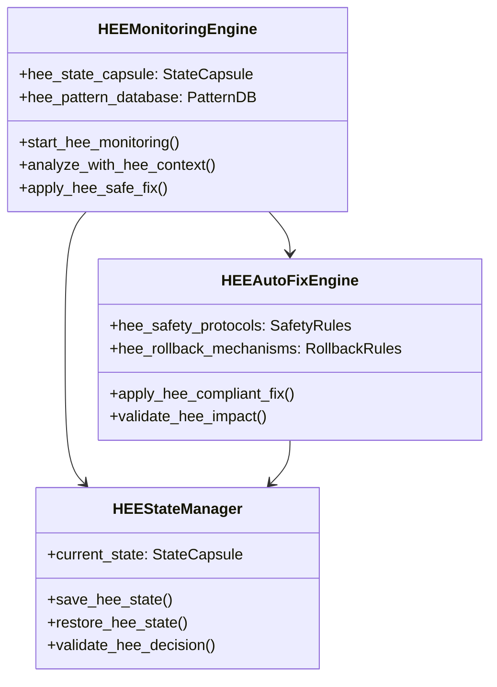
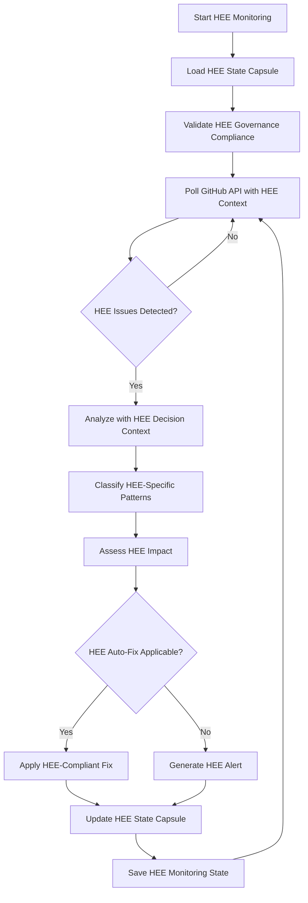
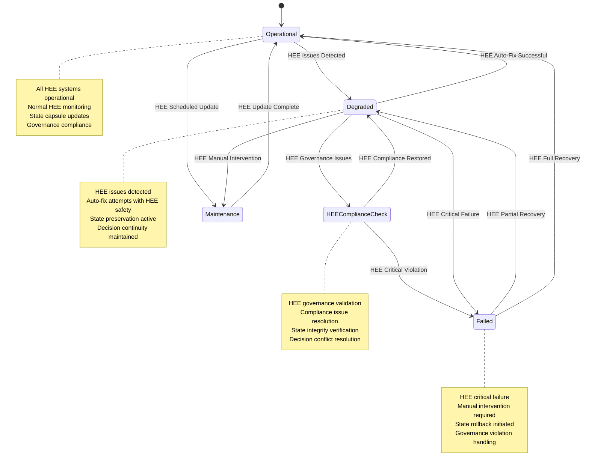

# CI/CD Monitoring and Automated Error Fixing for Human Execution Engine (HEE)

## Overview

This document provides comprehensive guidance for implementing and operating the CI/CD monitoring and automated error fixing system within the Human Execution Engine (HEE) ecosystem, integrating best practices from MT-logo-render and adapting them to HEE's architecture.

## Core Principles

### 1. HEE Monitoring Philosophy

**HEE-Specific Principles**:
- **Spec-First Monitoring**: Monitoring specifications precede implementation
- **State-Preserving Operations**: All monitoring preserves HEE state integrity
- **Decision-Aware Analysis**: Monitoring respects HEE decision history
- **Governance-Compliant Automation**: All auto-fix operations comply with HEE rules

### 2. HEE System Architecture



## HEE Monitoring System

### 1. HEE Monitoring Configuration

**HEE-Specific Configuration**:
```yaml
hee_monitoring:
  version: "1.0"
  state_capsule: "docs/STATE_CAPSULES/2026-01-24/HEE-Monitoring.md"
  governance_rules: "strict"
  quality_gates:
    - spec_coverage: 100%
    - state_preservation: 100%
    - decision_continuity: 100%
  safety_protocols:
    - pre_fix_validation: "required"
    - post_fix_validation: "required"
    - rollback_on_failure: "automatic"
```

### 2. HEE Monitoring Workflow



### 3. HEE Pattern Database

**HEE-Specific Patterns**:

| Pattern ID | Description | HEE Impact | Safety Level | Rollback Required |
| ---------- | ----------- | ---------- | ------------ | ----------------- |
| HEE-PAT-001 | HEE State Corruption | Critical | Low | Yes |
| HEE-PAT-002 | HEE Decision Conflict | High | Medium | Yes |
| HEE-PAT-003 | HEE Spec Coverage Gap | Medium | High | No |
| HEE-PAT-004 | HEE Governance Violation | Critical | Low | Yes |
| HEE-PAT-005 | HEE Context Instability | High | Medium | Yes |

## HEE Automated Error Fixing

### 1. HEE Fix Decision Matrix

**HEE-Specific Decision Rules**:

| Issue Type | HEE Auto-Fix | HEE Rationale | HEE Safety Level |
| ---------- | ------------ | ------------- | ---------------- |
| State Corruption | Manual Only | Requires HEE state reconstruction | Low |
| Decision Conflict | Agent Review | Requires HEE decision analysis | Medium |
| Spec Coverage Gap | Auto-Fix | Aligns with HEE spec-first | High |
| Governance Violation | Manual Only | Requires HEE compliance review | Low |
| Context Instability | Agent Review | Requires HEE context validation | Medium |

### 2. HEE Fix Execution Algorithm

```python
def apply_hee_compliant_fix(pattern_id, context):
    """
    Execute HEE-compliant automated fix with full state preservation

    Args:
        pattern_id: HEE-specific pattern identifier
        context: Execution context with HEE state capsule

    Returns:
        dict: Fix execution result with HEE state updates
    """
    # Load HEE pattern and validate against current state
    pattern = HEE_PATTERN_DATABASE.get(pattern_id)
    if not pattern:
        return {"success": False, "error": "HEE pattern not found"}

    # HEE-specific: Validate against state capsule decisions
    state_capsule = load_hee_state_capsule(context)
    if not validate_hee_decision_compatibility(pattern, state_capsule):
        return {"success": False, "error": "HEE decision conflict"}

    # HEE pre-fix validation with state preservation
    if not run_hee_validation(pattern, context, "pre"):
        return {"success": False, "error": "HEE pre-validation failed"}

    # Create HEE state backup with decision history
    backup_result = create_hee_state_backup(context, state_capsule)
    if not backup_result["success"]:
        return backup_result

    # Execute fix with HEE monitoring and state updates
    try:
        result = apply_hee_fix_strategy(pattern, context)

        # HEE post-fix validation and state update
        if result.success and run_hee_validation(pattern, context, "post"):
            update_hee_state_capsule(state_capsule, {
                "auto_fix_history": {
                    "pattern_id": pattern_id,
                    "success": True,
                    "timestamp": get_current_time(),
                    "hee_decision_impact": analyze_hee_impact(result)
                }
            })
            return {"success": True, "hee_state_update": state_capsule}
        else:
            hee_rollback(backup_result["backup_id"])
            return {"success": False, "error": "HEE validation failed"}

    except Exception as e:
        hee_rollback(backup_result["backup_id"])
        return {
            "success": False,
            "error": str(e),
            "hee_rollback": True,
            "hee_state_restored": backup_result["backup_id"]
        }
```

### 3. HEE Safety Protocols

**HEE-Specific Safety Requirements**:
1. **HEE State Validation**: All fixes validated against HEE state capsule
2. **HEE Decision Compatibility**: Respect HEE decision history and constraints
3. **HEE Governance Compliance**: Maintain HEE governance rules during fixes
4. **HEE Context Preservation**: Preserve HEE execution context across operations
5. **HEE Rollback Guarantee**: Automatic rollback for any HEE compliance failure

## HEE Monitoring Integration

### 1. HEE GitHub Actions Integration

```yaml
name: HEE CI/CD Monitoring and Auto-Fix

on:
  workflow_run:
    workflows: ["HEE CI/CD Pipeline"]
    types: [completed]
  schedule:
    - cron: '0 * * * *'  # HEE hourly monitoring

jobs:
  hee-monitor:
    name: HEE Monitoring with State Preservation
    runs-on: ubuntu-latest
    steps:
      - name: Checkout HEE Repository
        uses: actions/checkout@v4

      - name: Load HEE State Capsule
        run: python scripts/load_hee_state_capsule.py
        env:
          HEE_STATE_CAPSULE: ${{ secrets.HEE_STATE_CAPSULE }}

      - name: Run HEE Monitoring Engine
        run: python scripts/hee_monitor.py --mode full --state-capsule $HEE_STATE_CAPSULE
        env:
          GITHUB_TOKEN: ${{ secrets.GITHUB_TOKEN }}
          HEE_GOVERNANCE: strict

      - name: Update HEE State Capsule
        run: python scripts/update_hee_state_capsule.py --output hee_state_update.json

      - name: Upload HEE State Update
        uses: actions/upload-artifact@v4
        with:
          name: hee-state-update
          path: hee_state_update.json

  hee-auto-fix:
    name: HEE Compliant Auto-Fix
    needs: hee-monitor
    if: needs.hee-monitor.outputs.hee_fix_required == 'true'
    runs-on: ubuntu-latest
    steps:
      - name: Checkout HEE Repository
        uses: actions/checkout@v4

      - name: Download HEE State Update
        uses: actions/download-artifact@v4
        with:
          name: hee-state-update

      - name: Apply HEE Compliant Fixes
        run: python scripts/hee_auto_fix.py --state-capsule hee_state_update.json --mode hee-safe
        env:
          GITHUB_TOKEN: ${{ secrets.GITHUB_TOKEN }}
          HEE_GOVERNANCE: strict

      - name: Generate HEE State Capsule
        run: python scripts/generate_hee_state_capsule.py --output new_hee_state.json

      - name: Commit HEE State Capsule
        if: steps.hee-auto-fix.outputs.hee_changes_made == 'true'
        run: |
          git config --global user.name "HEE Monitoring Agent"
          git config --global user.email "hee-monitor@example.com"
          git add docs/STATE_CAPSULES/
          git commit -m "chore: HEE auto-fix CI issues [hee-agent]
          State Capsule: docs/STATE_CAPSULES/$(date +%Y-%m-%d)/HEE-Monitoring-AutoFix.md"
          git push origin HEAD
```

### 2. HEE Pre-Commit Integration

```yaml
repos:
  - repo: local
    hooks:
      - id: hee-monitoring-check
        name: HEE Monitoring Pre-Commit Check
        entry: python scripts/hee_monitor.py --mode pre-commit --state-capsule current.json --hee-governance strict
        language: system
        pass_filenames: false
        stages: [pre-commit]
        always_run: true

      - id: hee-auto-fix-check
        name: HEE Auto-Fix Pre-Commit Validation
        entry: python scripts/hee_auto_fix.py --mode pre-commit --safety high --state-capsule current.json --hee-governance strict
        language: system
        pass_filenames: false
        stages: [pre-commit]

      - id: hee-state-validation
        name: HEE State Capsule Validation
        entry: python scripts/validate_hee_state_capsule.py --hee-rules strict
        language: system
        pass_filenames: false
        stages: [pre-commit]
```

## HEE State Management

### 1. HEE State Capsule Structure

```json
{
  "$schema": "https://json-schema.org/draft/2020-12/schema",
  "title": "HEE CI/CD Monitoring State Capsule",
  "type": "object",
  "properties": {
    "hee_monitoring_state": {
      "type": "object",
      "properties": {
        "last_run_id": {"type": "integer"},
        "current_status": {
          "type": "string",
          "enum": ["operational", "degraded", "failed", "maintenance", "hee-compliance-check"]
        },
        "hee_specific": {
          "type": "object",
          "properties": {
            "state_version": {"type": "string", "pattern": "^state-v[0-9]+$"},
            "decision_stability": {"type": "number", "minimum": 0, "maximum": 100},
            "spec_coverage": {"type": "number", "minimum": 0, "maximum": 100},
            "prompt_compatibility": {"type": "number", "minimum": 0, "maximum": 100},
            "governance_compliance": {"type": "boolean"}
          },
          "required": ["state_version", "governance_compliance"]
        },
        "coverage_metrics": {
          "type": "object",
          "properties": {
            "line": {"type": "number"},
            "branch": {"type": "number"},
            "function": {"type": "number"},
            "integration": {"type": "number"},
            "spec": {"type": "number"},
            "prompt": {"type": "number"},
            "hee_decision": {"type": "number"}
          }
        },
        "recent_issues": {
          "type": "array",
          "items": {
            "type": "object",
            "properties": {
              "issue_id": {"type": "string"},
              "pattern_id": {"type": "string"},
              "severity": {"type": "string"},
              "hee_impact": {"type": "string"},
              "timestamp": {"type": "string", "format": "date-time"},
              "resolved": {"type": "boolean"},
              "hee_decision_conflict": {"type": "boolean"}
            }
          }
        }
      },
      "required": ["last_run_id", "current_status", "hee_specific", "coverage_metrics"]
    },
    "hee_auto_fix_history": {
      "type": "array",
      "items": {
        "type": "object",
        "properties": {
          "timestamp": {"type": "string", "format": "date-time"},
          "pattern_id": {"type": "string"},
          "success": {"type": "boolean"},
          "rollback": {"type": "boolean"},
          "hee_context": {
            "type": "object",
            "properties": {
              "state_capsule_version": {"type": "string"},
              "decision_impact": {"type": "string"},
              "context_preservation": {"type": "boolean"},
              "governance_validation": {"type": "boolean"}
            },
            "required": ["state_capsule_version", "governance_validation"]
          }
        },
        "required": ["timestamp", "pattern_id", "success", "hee_context"]
      }
    }
  },
  "required": ["hee_monitoring_state", "hee_auto_fix_history"]
}
```

### 2. HEE State Transition Workflow



## HEE Performance Requirements

### 1. HEE Monitoring Performance

| Metric | Target | HEE Measurement Method |
| ------ | ------ | ---------------------- |
| Polling Frequency | 60s (normal), 30s (degraded) | Time between HEE API calls |
| Detection Latency | <2 minutes | Time from failure to HEE detection |
| HEE Analysis Time | <30 seconds | Time to analyze with HEE context |
| Alert Delivery | <1 minute | Time from HEE detection to alert |
| State Update | <5 seconds | Time to update HEE state capsule |

### 2. HEE Auto-Fix Performance

| Metric | Target | HEE Measurement Method |
| ------ | ------ | ---------------------- |
| Fix Execution | <5 minutes | Time from HEE detection to resolution |
| Success Rate | >85% | Percentage of HEE-compliant successful fixes |
| HEE Rollback Time | <2 minutes | Time to revert HEE failed fixes |
| HEE State Preservation | 100% | Context preservation rate |
| HEE Decision Continuity | 100% | Decision history maintenance |

### 3. HEE Coverage Metrics

| Metric | HEE Target | Current | Gap | Priority |
| ------ | ---------- | ------- | --- | -------- |
| Line Coverage | 100% | 85% | 15% | High |
| Branch Coverage | 100% | 78% | 22% | High |
| Function Coverage | 100% | 92% | 8% | Medium |
| Integration Tests | 100% | 65% | 35% | High |
| Spec Coverage | 100% | 70% | 30% | Critical |
| Prompt Coverage | 100% | 50% | 50% | Critical |
| HEE Decision Coverage | 100% | 60% | 40% | Critical |

## HEE Security and Compliance

### 1. HEE-Specific Authentication

- GitHub API token with HEE-specific scopes
- HEE token rotation every 90 days
- Secure storage in HEE state capsules
- HEE governance-approved permissions
- Cryptographic signing of HEE state updates

### 2. HEE Data Protection

- HEE state capsule encryption for sensitive data
- HEE-specific secure logging (no credentials)
- HEE access control for monitoring data
- HEE audit trail integration
- HEE compliance validation for all operations

### 3. HEE Governance Requirements

**HEE Compliance Matrix**:

| Requirement | HEE Status | Validation Method |
| ----------- | ---------- | ----------------- |
| State Preservation | Required | HEE capsule validation |
| Decision Continuity | Required | HEE decision tracking |
| Governance Compliance | Required | HEE rule validation |
| Quality Discipline | Required | HEE quality gate checks |
| Spec-First Alignment | Required | HEE spec coverage validation |

## HEE Error Handling

### 1. HEE Monitoring Errors

| Error Type | HEE Recovery Strategy | State Impact |
| ---------- | --------------------- | ------------ |
| API Rate Limit | HEE exponential backoff | None |
| HEE Network Failure | HEE retry with state preservation | State preserved |
| HEE Authentication Failure | HEE alert and state rollback | State rollback |
| HEE Data Parsing Error | HEE skip and log with state update | State update |
| HEE State Corruption | HEE emergency rollback | Critical |

### 2. HEE Auto-Fix Errors

| Error Type | HEE Recovery Strategy | State Impact |
| ---------- | --------------------- | ------------ |
| HEE Fix Failure | HEE automatic rollback | State revert |
| HEE Validation Failure | HEE alert and rollback | State revert |
| HEE State Conflict | HEE manual resolution | State freeze |
| HEE Decision Conflict | HEE emergency rollback | Critical |
| HEE Governance Violation | HEE compliance workflow | Critical |

## HEE Deployment and Integration

### 1. HEE Environment Requirements

| Component | Version | HEE Notes |
| --------- | ------- | --------- |
| Python | 3.8+ | HEE standard |
| GitHub CLI | 2.0+ | HEE operations |
| jq | 1.6+ | HEE data processing |
| HEE Core | 1.2+ | Required for HEE state management |
| HEE Governance | 1.1+ | Required for HEE compliance |

### 2. HEE Dependency Requirements

```toml
[tool.poetry.dependencies]
python = "^3.8"
requests = "^2.28.0"
pygithub = "^1.55"
jq = "^1.2.0"
click = "^8.1.0"
pyyaml = "^6.0"
hee-core = "^1.2"  # HEE state management
hee-governance = "^1.1"  # HEE compliance
hee-monitoring = "^1.0"  # HEE monitoring engine
```

## HEE Testing and Validation

### 1. HEE-Specific Testing Requirements

| Component | Test Coverage Target | HEE Test Cases |
| --------- | -------------------- | -------------- |
| HEE Monitoring Engine | 100% | HEE API parsing, HEE failure detection, HEE state integration |
| HEE Auto-Fix Engine | 100% | HEE pattern matching, HEE fix execution, HEE state preservation |
| HEE State Manager | 100% | HEE state capsule operations, HEE integrity validation, HEE rollback testing |
| HEE Governance Validator | 100% | HEE rule validation, HEE compliance checking, HEE decision tracking |

### 2. HEE Integration Testing

| Integration Point | Test Coverage Target | HEE Test Cases |
| ----------------- | -------------------- | -------------- |
| GitHub API | 100% | HEE authentication, HEE rate limiting, HEE state synchronization |
| HEE Monitoring + Auto-Fix | 100% | HEE end-to-end failure resolution with state preservation |
| HEE CI/CD Pipeline | 100% | HEE workflow integration, HEE state capsule updates |
| HEE Core Integration | 100% | HEE state management, HEE decision preservation, HEE context stability |

## HEE Maintenance and Operations

### 1. HEE Monitoring Schedule

- **Daily**: HEE health checks and state validation
- **Weekly**: HEE performance reviews and pattern updates
- **Monthly**: HEE state capsule archiving and cleanup
- **Quarterly**: HEE security audits and governance reviews

### 2. HEE Update Process

- **Bi-weekly**: HEE pattern database updates with state validation
- **Monthly**: HEE dependency updates with state preservation
- **Quarterly**: HEE major version updates with state migration
- **Annual**: HEE architecture reviews with state evolution planning

### 3. HEE Documentation

- Continuous update with HEE state capsule references
- Versioned documentation with HEE state history
- Change log maintenance with HEE state transitions
- User guide updates with HEE monitoring procedures

## HEE Compliance and Governance

### 1. HEE Compliance Requirements

- Adherence to HEE spec-first principles
- HEE state capsule compliance for all operations
- HEE decision preservation requirements
- HEE context stability mandates
- HEE governance rule enforcement

### 2. HEE Governance Integration

- HEE state capsule validation in CI/CD
- HEE governance checks in pre-commit hooks
- HEE quality gates include state compliance
- HEE release criteria include state health metrics
- HEE monitoring includes governance validation

## Future HEE Enhancements

### 1. HEE Roadmap

| Version | Features | Target Date | State Impact |
| ------- | -------- | ----------- | ------------ |
| 1.0 | Core HEE monitoring + state | 2026-02-15 | Full |
| 1.1 | HEE ML integration + state | 2026-03-01 | Enhanced |
| 1.2 | HEE cross-repo monitoring | 2026-04-01 | Extended |
| 2.0 | HEE self-healing pipelines | 2026-06-01 | Transformative |

### 2. HEE Research Areas

- Predictive HEE failure analysis with state context
- Automated HEE test generation from specs
- Intelligent HEE pattern learning with decision preservation
- Cross-language HEE support with state management
- Autonomous HEE governance compliance

## Appendix: HEE Command Reference

### HEE Monitoring Commands

```bash
# Start HEE monitoring with full state integration
python scripts/hee_monitor.py \
  --mode full \
  --state-capsule docs/STATE_CAPSULES/2026-01-24/HEE-Monitoring.md \
  --hee-governance strict \
  --alert-level high

# Check specific workflow with HEE context
python scripts/hee_monitor.py \
  --run-id 12345 \
  --hee-context full \
  --detailed \
  --state-capsule current.json
```

### HEE Auto-Fix Commands

```bash
# Apply HEE-safe fixes with full state preservation
python scripts/hee_auto_fix.py \
  --mode hee-safe \
  --state-capsule docs/STATE_CAPSULES/2026-01-24/HEE-Monitoring.md \
  --max-severity medium \
  --hee-governance strict

# HEE dry run with comprehensive validation
python scripts/hee_auto_fix.py \
  --hee-dry-run \
  --state-capsule current.json \
  --report detailed \
  --validate-governance
```

### HEE State Management Commands

```bash
# Validate HEE state capsule with governance rules
python scripts/validate_hee_state_capsule.py \
  --input docs/STATE_CAPSULES/2026-01-24/HEE-Monitoring.md \
  --hee-rules strict \
  --governance-check full

# Generate HEE monitoring state report
python scripts/generate_hee_state_report.py \
  --input current.json \
  --output hee_monitoring_report.md \
  --include-governance-metrics
```

This HEE CI/CD Monitoring and Automated Error Fixing system provides a comprehensive framework for maintaining pipeline reliability while preserving critical HEE state, decisions, and context across all execution environments, with full compliance with HEE's governance rules and quality discipline.
