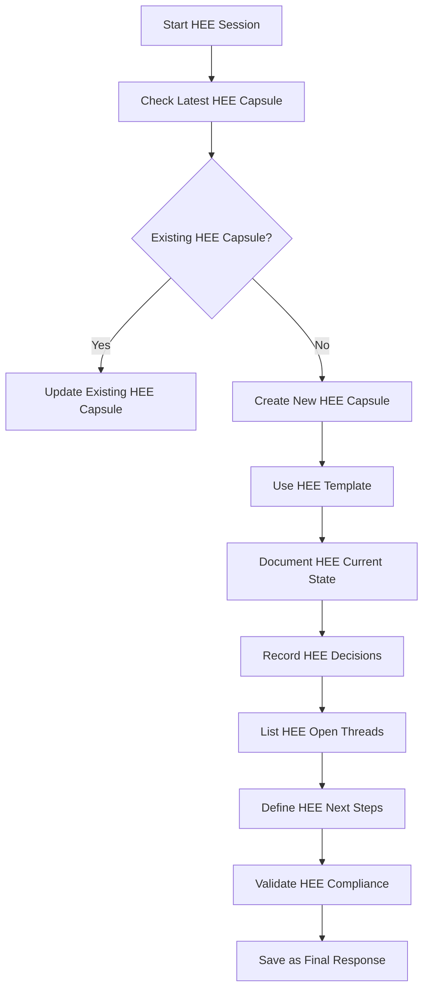

# State Capsule Guide for Human Execution Engine (HEE)

## Overview

This guide provides comprehensive instructions for creating, using, and managing State Capsules within the Human Execution Engine (HEE) ecosystem. State Capsules are structured handoff documents that preserve decision state and context when transitioning between agents, chat sessions, or execution contexts.

## Core Principles

### 1. Purpose and Scope

**Primary Objectives**:
- **Continuation Vector**: Enable seamless handoffs between HEE execution contexts
- **Decision Preservation**: Maintain critical decision state across HEE transitions
- **Context Stability**: Prevent loss of important HEE context and requirements
- **Workflow Efficiency**: Reduce rework and context reconstruction overhead in HEE operations

### 2. HEE-Specific Requirements

**HEE Integration Mandates**:
- All State Capsules must comply with HEE governance rules
- State Capsules must preserve HEE decision history
- Context must include HEE-specific integration points
- Next steps must align with HEE execution protocols

## State Capsule Structure

### 1. Required Components

```yaml
chat: <project-name> <phase/session>
purpose: <one-sentence objective>
context:
  - Project: <project description>
  - Current Phase: <current phase or milestone>
  - Status: <current status and recent progress>
  - Constraints: <important constraints or requirements>
  - Dependencies: <key dependencies or blockers>
  - Tools/Technologies: <key tools, frameworks, or technologies>
  - HEE Integration: <HEE-specific integration points and requirements>

decisions:
  - <specific decision made with rationale>
  - <technical choice and why it was chosen>
  - <architectural decision and its impact>
  - <any trade-offs that were considered>
  - <HEE-specific decisions and their implications>

open_threads:
  - <unresolved issue or pending task>
  - <dependency or blocker>
  - <next major milestone>
  - <risk or concern that needs attention>
  - <question that needs answering>
  - <HEE-specific open items>

next_chat_bootstrap:
  - <immediate next step to take>
  - <how to continue current work>
  - <what to investigate or implement>
  - <priority order for remaining tasks>
  - <HEE-specific bootstrap instructions>
```

### 2. HEE-Specific Component Requirements

#### Chat Identifier
- **Format**: `<Project> <Phase/Session> [HEE]`
- **Example**: `HEE CI Monitoring Integration Phase 1`
- **HEE Requirement**: Must include HEE identifier for HEE projects

#### Purpose Statement
- **Format**: Single sentence with HEE alignment
- **Example**: `Integrate MT-logo-render CI monitoring into HEE with full state preservation`
- **HEE Requirement**: Must reference HEE integration or objectives

#### Context Section
- **HEE-Specific Requirements**:
  - HEE Integration: Specify HEE version and integration points
  - HEE Constraints: Document HEE governance and quality requirements
  - HEE Dependencies: List HEE core components and versions
  - HEE State Requirements: Specify state capsule compatibility

#### Decisions Section
- **HEE-Specific Requirements**:
  - HEE Decision Impact: Analyze impact on HEE architecture
  - HEE Rationale: Explain alignment with HEE principles
  - HEE Trade-offs: Document HEE-specific considerations
  - HEE Compliance: Note governance and quality implications

#### Open Threads Section
- **HEE-Specific Requirements**:
  - HEE Priority: Assign HEE-specific priority levels
  - HEE Blockers: Identify HEE ecosystem dependencies
  - HEE Risks: Assess risks with HEE impact analysis
  - HEE Milestones: Align with HEE roadmap

#### Next Chat Bootstrap
- **HEE-Specific Requirements**:
  - HEE Execution Context: Provide HEE-specific instructions
  - HEE Continuation: Specify HEE workflow continuation points
  - HEE Investigation: Define HEE-focused investigation priorities
  - HEE Implementation: Outline HEE-compliant implementation steps

## Creation Process

### 1. HEE State Capsule Creation Workflow



### 2. HEE Template Usage

**HEE Template Location**: `docs/TEMPLATES/STATE_CAPSULE_TEMPLATE.md`

**HEE Creation Command**:
```bash
# Create new HEE capsule from template
cp docs/TEMPLATES/STATE_CAPSULE_TEMPLATE.md docs/STATE_CAPSULES/$(date +%Y-%m-%d)/HEE-[Project]-Session.md
```

## Usage Patterns

### 1. HEE Agent Handoffs

**HEE Agent Transition Pattern**:
```
HEE Agent A → State Capsule → HEE Agent B → Updated State Capsule → HEE Agent C
```

**HEE-Specific Benefits**:
- Preserves HEE context across agent transitions
- Maintains HEE decision continuity
- Enables HEE specialization and workflow optimization
- Reduces HEE context reconstruction overhead

### 2. HEE Release Management

**HEE Release Pattern**:
```
Pre-Release Capsule → Release Capsule → Post-Release Capsule → Maintenance Capsule
```

**HEE-Specific Benefits**:
- Clear HEE release phase boundaries
- Comprehensive HEE release documentation
- Decision history for HEE release analysis
- Risk tracking throughout HEE release lifecycle

### 3. HEE Cross-Project Integration

**HEE Ecosystem Pattern**:
```
HEE Core Capsule → MT-logo-render Integration Capsule → tick-task Integration Capsule
```

**HEE-Specific Benefits**:
- HEE ecosystem context preservation
- Dependency management across HEE projects
- Integration point documentation
- HEE-wide decision tracking

## HEE-Specific Best Practices

### ✅ HEE Recommended Practices

**Practice 1**: HEE-Specific Context
```yaml
context:
  - Project: Human Execution Engine v1.2.3 Integration
  - HEE Integration: Full state capsule support required
  - HEE Constraints: Must comply with spec-first discipline
  - HEE Dependencies: Core v1.1.5+, prompts v17+
  - HEE State Requirements: state-v2 compatibility
```

**Practice 2**: HEE Decision Rationale
```yaml
decisions:
  - Use HEE canonical prompts for all agent interactions
    Rationale: Ensures HEE editor-agnostic consistency
    Impact: Maintains HEE governance compliance
    HEE Alignment: Prompt canonicalization rules
```

**Practice 3**: HEE Execution Continuity
```yaml
next_chat_bootstrap:
  - Finalize HEE state capsule structure for monitoring
  - Implement HEE safety protocol validation in auto-fix
  - Test HEE state preservation during monitoring operations
  - Update HEE documentation with monitoring integration guide
```

### ❌ HEE Anti-Patterns to Avoid

**Anti-Pattern 1**: Generic HEE Context
```yaml
context:
  - Project: Some project  # Too generic for HEE
  - HEE Integration: None  # Missing HEE integration
```

**Anti-Pattern 2**: Vague HEE Next Steps
```yaml
next_chat_bootstrap:
  - Continue HEE work  # Too vague for HEE execution
  - Fix some issues    # No HEE specificity
```

**Anti-Pattern 3**: Ignoring HEE State Requirements
```yaml
decisions:
  - Change state format without HEE compatibility  # Violates HEE principles
  - Bypass HEE governance for speed              # Violates HEE rules
```

## HEE Integration

### 1. HEE Git Integration

**HEE-Specific Practices**:
- Version control all HEE state capsules
- Include capsule references in HEE commit messages
- Link capsules in HEE pull request descriptions
- Use in HEE release notes with state transitions

**HEE Git Commands**:
```bash
# Add HEE state capsule to git
git add docs/STATE_CAPSULES/$(date +%Y-%m-%d)/HEE-*.md

# Commit with HEE state reference
git commit -m "feat: Implement CI monitoring [hee-agent]
State Capsule: docs/STATE_CAPSULES/2026-01-24/HEE-CI-Integration.md"
```

### 2. HEE CI/CD Integration

**HEE Integration Points**:
- Generate HEE capsule summaries in build artifacts
- Include HEE capsule links in deployment notifications
- Use HEE capsule metadata for project status updates
- Validate HEE capsule structure in documentation checks

**HEE CI Configuration**:
```yaml
# .github/workflows/hee-ci.yml
- name: Validate HEE State Capsules
  run: python scripts/validate_hee_capsules.py --state-dir docs/STATE_CAPSULES/
```

### 3. HEE Project Management

**HEE Usage Patterns**:
- Reference in HEE sprint planning and retrospectives
- Use for HEE knowledge transfer during team changes
- Include in HEE project documentation and wikis
- Link to relevant capsules in HEE issue tracking

## HEE Quality Assurance

### 1. HEE Content Validation Checklist

- [ ] Identified current HEE project phase and status
- [ ] Documented all HEE-relevant decisions with rationale
- [ ] Listed all HEE-specific unresolved issues
- [ ] Defined HEE-aligned next steps
- [ ] Used HEE terminology and conventions
- [ ] Included HEE state preservation requirements
- [ ] Prioritized items with HEE impact assessment
- [ ] Made next steps HEE-execution ready
- [ ] Validated HEE governance compliance
- [ ] Verified HEE quality discipline requirements

### 2. HEE Structural Validation

**HEE Validation Script**:
```bash
# Validate HEE capsule structure
python scripts/validate_hee_capsule.py \
  --input docs/STATE_CAPSULES/2026-01-24/HEE-CI-Integration.md \
  --hee-rules strict
```

## Advanced HEE Patterns

### 1. HEE Multi-Agent Collaboration

**HEE Agent Chain Pattern**:
```yaml
# Agent A State Capsule
chat: HEE CI Monitoring - Agent A Session
decisions:
  - Analyzed MT-logo-render monitoring patterns
  - Identified HEE integration requirements
open_threads:
  - Adapt patterns to HEE state format
  - Implement HEE safety protocols
next_chat_bootstrap:
  - Adapt monitoring patterns to HEE
  - Create HEE-compatible pattern database

# Agent B State Capsule (continuation)
chat: HEE CI Monitoring - Agent B Session
context:
  - Continuing from: HEE CI Monitoring - Agent A Session
  - Current State: Patterns adapted, safety protocols needed
decisions:
  - Implemented HEE safety protocols in auto-fix
  - Validated pattern compatibility with HEE state
open_threads:
  - Test HEE state preservation
  - Document integration guide
next_chat_bootstrap:
  - Test HEE state preservation scenarios
  - Create comprehensive HEE documentation
```

### 2. HEE Decision Tree Preservation

**HEE Decision Chain Pattern**:
```yaml
decisions:
  - Decision 1: Use HEE state capsules for monitoring
    Rationale: Ensures HEE context preservation
    Impact: Full HEE integration capability
    Follow-up: Decision 2 required

  - Decision 2: Implement HEE safety protocols
    Rationale: Maintains HEE quality discipline
    Impact: Safe HEE auto-fix operations
    Follow-up: Decision 3 required

  - Decision 3: Add HEE spec coverage metrics
    Rationale: Aligns with HEE spec-first principles
    Impact: Comprehensive HEE monitoring
```

## HEE Template Management

### 1. HEE Template Location and Usage

**HEE Template Structure**:
```
docs/
└── TEMPLATES/
    └── STATE_CAPSULE_TEMPLATE.md  # HEE canonical template
```

**HEE Template Commands**:
```bash
# Create new HEE capsule from template
cp docs/TEMPLATES/STATE_CAPSULE_TEMPLATE.md \
   docs/STATE_CAPSULES/$(date +%Y-%m-%d)/HEE-[Project]-Session.md

# Validate HEE template compliance
python scripts/validate_hee_template.py \
  --template docs/TEMPLATES/STATE_CAPSULE_TEMPLATE.md
```

### 2. HEE Directory Management

**HEE Automation Scripts**:
```bash
# Create HEE date directory if needed
mkdir -p docs/STATE_CAPSULES/$(date +%Y-%m-%d)

# Find latest HEE capsule
LATEST_HEE=$(ls -dt docs/STATE_CAPSULES/*/ | head -1)/HEE-*.md

# List all HEE capsules
find docs/STATE_CAPSULES/ -name "HEE-*.md" | sort
```

## HEE-Specific Validation

### 1. HEE Content Requirements

**HEE-Specific Checks**:
- HEE state version compatibility
- HEE decision preservation requirements
- HEE spec coverage integration
- HEE prompt compatibility
- HEE execution continuity
- HEE governance compliance
- HEE quality discipline adherence

### 2. HEE Structural Validation

**HEE Validation Rules**:
- All required HEE sections present and non-empty
- HEE YAML format compliance
- HEE naming conventions followed (`HEE-*` prefix)
- HEE date and version references accurate
- HEE file organization maintained
- HEE template compliance verified

## HEE Integration with Core Systems

### 1. HEE State Capsule Integration

**HEE State Management**:
- State capsules preserve HEE execution context
- Decision history maintained across HEE sessions
- Context stability ensured for HEE operations
- HEE-specific metadata included in all capsules

### 2. HEE Prompt Governance Integration

**HEE Prompt Compliance**:
- State capsules reference canonical HEE prompts
- No authoritative content in wrapper files
- HEE governance rules enforced in capsules
- Prompt version compatibility documented

### 3. HEE CI/CD Monitoring Integration

**HEE Monitoring Integration**:
- State capsules include monitoring metadata
- CI/CD status preserved in capsules
- Auto-fix history documented
- Monitoring decisions tracked

## Future HEE Enhancements

### 1. HEE Automation Roadmap

- **Phase 1**: HEE template validation scripts
- **Phase 2**: Automated HEE capsule generation
- **Phase 3**: HEE capsule versioning system
- **Phase 4**: AI-assisted HEE capsule analysis

### 2. HEE Advanced Features

- HEE capsule versioning and diffing
- Cross-reference linking between capsules
- Automated HEE dependency tracking
- HEE knowledge base integration

### 3. HEE Research Areas

- Predictive HEE context analysis
- Automated HEE decision extraction
- HEE pattern recognition in capsules
- Cross-project HEE context mapping

## Appendix: HEE Command Reference

### HEE State Capsule Commands

```bash
# Generate HEE state capsule
python scripts/generate_hee_capsule.py \
  --project "CI Monitoring Integration" \
  --phase "Phase 1" \
  --output docs/STATE_CAPSULES/$(date +%Y-%m-%d)/HEE-CI-Integration.md

# Validate HEE state capsule
python scripts/validate_hee_capsule.py \
  --input docs/STATE_CAPSULES/2026-01-24/HEE-CI-Integration.md \
  --hee-rules strict

# Update HEE state capsule
python scripts/update_hee_capsule.py \
  --input existing.md \
  --decision "Implemented HEE safety protocols" \
  --open-thread "Test HEE state preservation" \
  --next-step "Create HEE documentation" \
  --output updated.md
```

### HEE Directory Management

```bash
# Archive old HEE capsules
python scripts/archive_hee_capsules.py \
  --older-than 30 \
  --destination docs/STATE_CAPSULES/archive/

# Find HEE capsules by project
python scripts/find_hee_capsules.py \
  --project "CI Monitoring" \
  --output results.txt

# Generate HEE capsule index
python scripts/generate_hee_index.py \
  --input docs/STATE_CAPSULES/ \
  --output HEE_CAPSULE_INDEX.md
```

This HEE State Capsule Guide provides comprehensive instructions for creating, using, and managing State Capsules within the Human Execution Engine ecosystem, ensuring full compliance with HEE's governance rules, quality discipline, and state preservation requirements.
