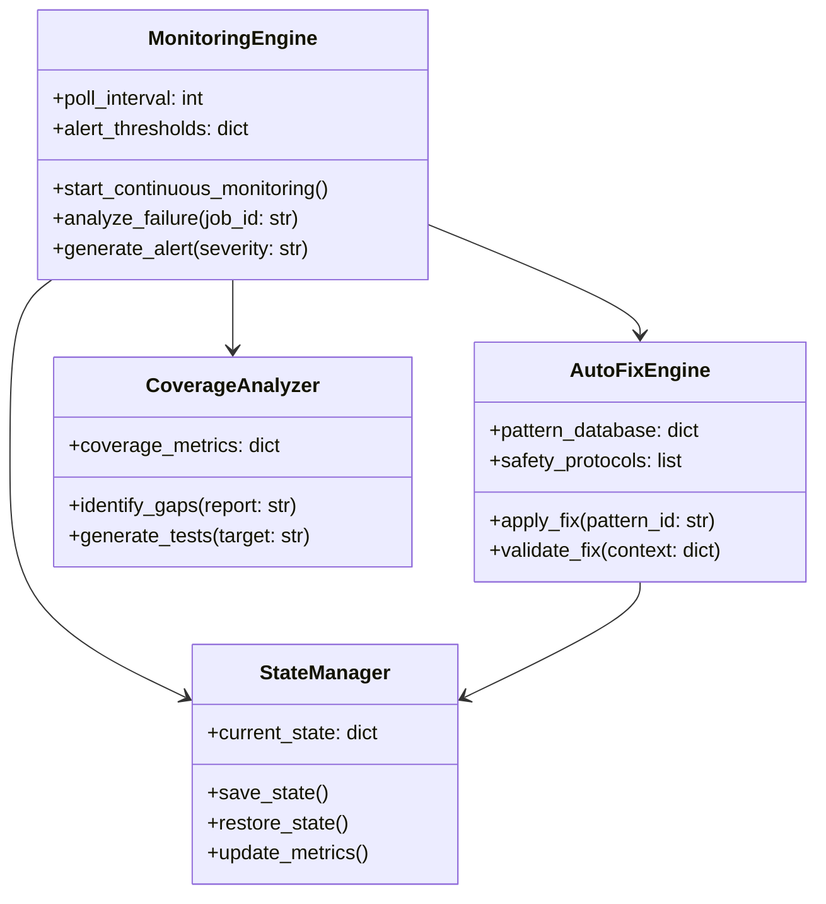
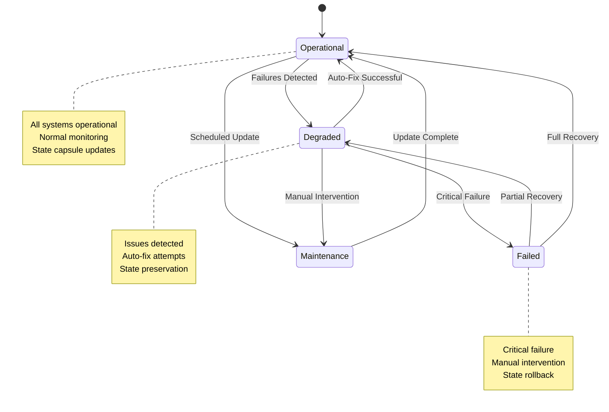

# CI/CD Monitoring and Automated Error Fixing System

## Overview

This document specifies the comprehensive CI/CD monitoring and automated error resolution system for the Human Execution Engine (HEE) ecosystem, integrating best practices from MT-logo-render and adapting them to HEE's architecture.

## System Architecture

### 1. Core Components



### 2. Integration with HEE Principles

**Spec-First Alignment**:
- Monitoring specifications precede implementation
- Auto-fix patterns are documented before coding
- Coverage targets are specified upfront

**Quality Discipline**:
- Comprehensive validation before any automated fixes
- Safety protocols enforce quality gates
- Rollback mechanisms ensure system stability

## Monitoring System Specification

### 1. Monitoring Engine

**Capabilities**:
- Real-time surveillance of GitHub Actions workflows
- Adaptive polling based on system health
- Pattern-based failure detection
- Multi-channel alerting system

**Performance Targets**:
- Normal polling: 60 seconds
- Degraded state polling: 30 seconds
- Detection latency: < 2 minutes
- Alert delivery: < 1 minute

### 2. Failure Detection Patterns

| Pattern ID | Description            | Detection Method                       | Severity |
| ---------- | ---------------------- | -------------------------------------- | -------- |
| PAT-001    | Compilation Failure    | `conclusion == "failure"` in build job | Critical |
| PAT-002    | Test Failure           | `conclusion == "failure"` in test job  | High     |
| PAT-003    | Security Vulnerability | Security scan artifacts contain issues | Critical |
| PAT-004    | License Compliance     | License check fails                    | Medium   |
| PAT-005    | Timeout                | Job runs longer than expected          | Medium   |
| PAT-006    | Dependency Issue       | "command not found" in logs            | High     |

### 3. Alert Escalation Matrix

| Severity Level | Response Time | Notification Channels      | HEE Integration |
| -------------- | ------------- | -------------------------- | --------------- |
| Critical       | Immediate     | Console, Email, Slack, SMS | State Capsule + Agent Alert |
| High           | 5 minutes     | Console, Email, Slack      | State Capsule Update |
| Medium         | 15 minutes    | Console, Email             | Log Entry |
| Low            | 1 hour        | Console                    | Monitoring Log |

## Automated Error Fixing Framework

### 1. Decision Matrix

| Error Type               | Auto-Fix Capability | Safety Level | Rollback Required | HEE Integration |
| ------------------------ | ------------------- | ------------ | ----------------- | --------------- |
| Clippy Warnings          | Full                | High         | No                | Auto-apply |
| Dependency Issues        | Partial             | Medium       | Yes               | Agent Review |
| Test Logic Errors        | Full                | High         | No                | Auto-apply |
| Security Vulnerabilities | Partial             | Low          | Yes               | Manual Only |
| License Compliance       | Full                | High         | No                | Auto-apply |

### 2. Fixing Algorithm

```python
def execute_fix(pattern_id, context):
    """
    Execute automated fix with HEE safety protocols

    Args:
        pattern_id: Detected error pattern
        context: Execution context with state capsule

    Returns:
        dict: Fix execution result with state updates
    """
    # Load pattern and validate against current state
    pattern = PATTERN_DATABASE.get(pattern_id)
    if not pattern:
        return {"success": False, "error": "Pattern not found"}

    # HEE-specific: Check state capsule for constraints
    state_capsule = load_state_capsule(context)
    if not validate_against_constraints(pattern, state_capsule):
        return {"success": False, "error": "Constraint violation"}

    # Pre-fix validation with state preservation
    if not run_validation(pattern, context, "pre"):
        return {"success": False, "error": "Pre-validation failed"}

    # Create state backup (HEE requirement)
    backup_result = create_state_backup(context, state_capsule)
    if not backup_result["success"]:
        return backup_result

    # Execute fix with HEE monitoring
    try:
        result = apply_fix_strategy(pattern, context)

        # Post-fix validation and state update
        if result.success and run_validation(pattern, context, "post"):
            update_state_capsule(state_capsule, {
                "auto_fix_history": {
                    "pattern_id": pattern_id,
                    "success": True,
                    "timestamp": get_current_time()
                }
            })
            return {"success": True, "state_update": state_capsule}
        else:
            rollback(backup_result["backup_id"])
            return {"success": False, "error": "Validation failed"}

    except Exception as e:
        rollback(backup_result["backup_id"])
        return {"success": False, "error": str(e), "rollback": True}
```

### 3. Safety Protocols

**HEE-Specific Requirements**:
1. **State Capsule Validation**: All fixes validated against current state
2. **Constraint Checking**: Respect project constraints from capsule
3. **Decision Preservation**: Maintain decision history during fixes
4. **Context Stability**: Preserve critical context across operations

## Test Coverage Enhancement

### 1. HEE Coverage Metrics

```python
class HEECoverageMetrics:
    def __init__(self):
        self.line_coverage = 0.0
        self.branch_coverage = 0.0
        self.function_coverage = 0.0
        self.integration_coverage = 0.0
        self.spec_coverage = 0.0  # HEE-specific
        self.prompt_coverage = 0.0  # HEE-specific

    def calculate_hee_total(self):
        """Calculate HEE-specific coverage score"""
        weights = {
            "line": 0.3,
            "branch": 0.2,
            "function": 0.2,
            "integration": 0.1,
            "spec": 0.15,  # HEE emphasis on spec coverage
            "prompt": 0.05  # HEE prompt testing
        }
        return sum(getattr(self, f"{key}_coverage") * weight
                  for key, weight in weights.items())
```

### 2. Coverage Targets

| Metric            | HEE Target | Current | Gap | Priority |
| ----------------- | ---------- | ------- | --- | -------- |
| Line Coverage     | 100%       | 85%     | 15% | High     |
| Branch Coverage   | 100%       | 78%     | 22% | High     |
| Function Coverage | 100%       | 92%     | 8%  | Medium   |
| Integration Tests | 100%       | 65%     | 35% | High     |
| Spec Coverage     | 100%       | 70%     | 30% | Critical |
| Prompt Coverage   | 100%       | 50%     | 50% | Critical |

### 3. HEE Test Generation Strategies

| Strategy         | Description                        | HEE Implementation     |
| ---------------- | ---------------------------------- | ---------------------- |
| Property-Based   | Generate tests based on properties | Hypothesis + HEE specs |
| Fuzz Testing     | Random input generation            | AFL + HEE constraints  |
| Mutation Testing | Modify code to test effectiveness  | Mutagen + HEE rules    |
| Coverage-Guided  | Target uncovered code paths        | Custom HEE analyzer    |
| Spec-Based       | Test against specifications        | HEE spec validator     |

## Integration with HEE Systems

### 1. GitHub Actions Integration

```yaml
name: HEE CI Monitoring and Auto-Fix

on:
  workflow_run:
    workflows: ["HEE CI/CD Pipeline"]
    types: [completed]
  schedule:
    - cron: '0 * * * *'  # Hourly monitoring

jobs:
  monitor:
    name: HEE CI Monitoring
    runs-on: ubuntu-latest
    steps:
      - name: Checkout HEE code
        uses: actions/checkout@v4

      - name: Load State Capsule
        run: python scripts/load_state_capsule.py
        env:
          STATE_CAPSULE: ${{ secrets.STATE_CAPSULE }}

      - name: Run HEE CI Monitor
        run: python scripts/ci_monitor.py --mode hee --state-capsule $STATE_CAPSULE
        env:
          GITHUB_TOKEN: ${{ secrets.GITHUB_TOKEN }}

      - name: Update State Capsule
        run: python scripts/update_state_capsule.py --output state-update.json

      - name: Upload State Update
        uses: actions/upload-artifact@v4
        with:
          name: hee-state-update
          path: state-update.json

  auto-fix:
    name: HEE Auto-Fix
    needs: monitor
    if: needs.monitor.outputs.fix_required == 'true'
    runs-on: ubuntu-latest
    steps:
      - name: Checkout HEE code
        uses: actions/checkout@v4

      - name: Download State Update
        uses: actions/download-artifact@v4
        with:
          name: hee-state-update

      - name: Apply HEE Auto-Fixes
        run: python scripts/auto_fix.py --state-capsule state-update.json --mode hee-safe
        env:
          GITHUB_TOKEN: ${{ secrets.GITHUB_TOKEN }}

      - name: Generate State Capsule
        run: python scripts/generate_state_capsule.py --output new-state.json

      - name: Commit State Capsule
        if: steps.auto-fix.outputs.changes_made == 'true'
        run: |
          git config --global user.name "HEE Auto-Fix Agent"
          git config --global user.email "hee-agent@example.com"
          git add docs/STATE_CAPSULES/
          git commit -m "chore: Auto-fix CI failures [hee-agent]"
          git push origin HEAD
```

### 2. Pre-Commit Integration

```yaml
repos:
  - repo: local
    hooks:
      - id: hee-ci-monitoring
        name: HEE CI Monitoring Check
        entry: python scripts/ci_monitor.py --mode pre-commit --state-capsule current.json
        language: system
        pass_filenames: false
        stages: [pre-commit]

      - id: hee-auto-fix
        name: HEE Auto-Fix Pre-Commit
        entry: python scripts/auto_fix.py --mode pre-commit --safety high --state-capsule current.json
        language: system
        pass_filenames: false
        stages: [pre-commit]

      - id: hee-state-validation
        name: HEE State Capsule Validation
        entry: python scripts/validate_state_capsule.py
        language: system
        pass_filenames: false
        stages: [pre-commit]
```

## State Management Integration

### 1. HEE State Capsule Structure

```json
{
  "$schema": "https://json-schema.org/draft/2020-12/schema",
  "title": "HEE CI Monitoring State Capsule",
  "type": "object",
  "properties": {
    "monitoring_state": {
      "type": "object",
      "properties": {
        "last_run_id": {"type": "integer"},
        "current_status": {
          "type": "string",
          "enum": ["operational", "degraded", "failed", "maintenance"]
        },
        "hee_specific": {
          "type": "object",
          "properties": {
            "spec_coverage": {"type": "number", "minimum": 0, "maximum": 100},
            "prompt_coverage": {"type": "number", "minimum": 0, "maximum": 100},
            "decision_stability": {"type": "number", "minimum": 0, "maximum": 100}
          }
        },
        "coverage_metrics": {
          "type": "object",
          "properties": {
            "line": {"type": "number"},
            "branch": {"type": "number"},
            "function": {"type": "number"},
            "integration": {"type": "number"},
            "spec": {"type": "number"},
            "prompt": {"type": "number"}
          }
        }
      }
    },
    "auto_fix_history": {
      "type": "array",
      "items": {
        "type": "object",
        "properties": {
          "timestamp": {"type": "string", "format": "date-time"},
          "pattern_id": {"type": "string"},
          "success": {"type": "boolean"},
          "rollback": {"type": "boolean"},
          "hee_context": {
            "type": "object",
            "properties": {
              "state_capsule_version": {"type": "string"},
              "decision_impact": {"type": "string"},
              "context_preservation": {"type": "boolean"}
            }
          }
        }
      }
    }
  }
}
```

### 2. State Transition Workflow



## Performance Requirements

### 1. HEE-Specific Monitoring Performance

| Metric            | Target                                       | Measurement Method               |
| ----------------- | -------------------------------------------- | -------------------------------- |
| Polling Frequency | 60s (normal), 30s (degraded)                 | Time between API calls           |
| Detection Latency | < 2 minutes                                  | Time from failure to detection   |
| Analysis Time     | < 30 seconds                                 | Time to analyze failure patterns |
| Alert Delivery    | < 1 minute                                   | Time from detection to alert     |
| State Update      | < 5 seconds                                  | Time to update state capsule     |

### 2. Auto-Fix Performance

| Metric             | Target      | Measurement Method                |
| ------------------ | ----------- | --------------------------------- |
| Fix Execution Time | < 5 minutes | Time from detection to resolution |
| Success Rate       | > 85%       | Percentage of successful fixes    |
| Rollback Time      | < 2 minutes | Time to revert failed fixes       |
| State Preservation | 100%        | Context preservation rate        |

### 3. Coverage Analysis Performance

| Metric               | Target             | Measurement Method               |
| -------------------- | ------------------ | -------------------------------- |
| Analysis Time        | < 2 minutes        | Time to process coverage reports |
| Gap Identification   | < 30 seconds       | Time to identify coverage gaps   |
| Test Generation      | < 5 minutes        | Time to generate new tests       |
| HEE Coverage Calc    | < 10 seconds       | Time to calculate HEE metrics    |

## Security Requirements

### 1. HEE-Specific Authentication

- GitHub API token with HEE-specific scopes
- Token rotation every 90 days (HEE policy)
- Secure storage in HEE state capsules
- Minimal required permissions with audit logging

### 2. Data Protection

- State capsule encryption for sensitive data
- Secure logging (no credentials or sensitive info)
- Access control for monitoring data
- HEE-specific audit trail integration

### 3. State Capsule Security

- Cryptographic signing of state capsules
- Integrity validation on load
- Version history preservation
- Rollback protection mechanisms

## Error Handling and Recovery

### 1. HEE Monitoring Errors

| Error Type             | Recovery Strategy   | State Impact |
| ---------------------- | ------------------- | ------------ |
| API Rate Limit         | Exponential backoff | None         |
| Network Failure        | Retry with delay    | State preserved |
| Authentication Failure | Alert and stop      | State rollback |
| Data Parsing Error     | Skip and log        | State update  |
| State Corruption       | Rollback to backup  | Critical     |

### 2. Auto-Fix Errors

| Error Type         | Recovery Strategy         | State Impact |
| ------------------ | ------------------------- | ------------ |
| Fix Failure        | Automatic rollback        | State revert |
| Validation Failure | Alert and rollback        | State revert |
| State Conflict     | Manual resolution         | State freeze |
| Context Loss       | Emergency rollback        | Critical     |

## Deployment and Integration

### 1. HEE Environment Requirements

| Component  | Version | HEE Notes |
| ---------- | ------- | --------- |
| Python     | 3.8+    | HEE standard |
| GitHub CLI | 2.0+    | HEE operations |
| jq         | 1.6+    | HEE data processing |
| cargo      | Latest  | HEE Rust toolchain |
| HEE Core   | Latest  | Required for state management |

### 2. HEE Dependency Requirements

```toml
[tool.poetry.dependencies]
python = "^3.8"
requests = "^2.28.0"
pygithub = "^1.55"
jq = "^1.2.0"
click = "^8.1.0"
pyyaml = "^6.0"
xmltodict = "^0.13.0"
hee-core = "^1.0"  # HEE specific
hee-state = "^1.0"  # HEE state management
```

## Testing and Validation

### 1. HEE-Specific Testing Requirements

| Component         | Test Coverage Target | HEE Test Cases |
| ----------------- | -------------------- | -------------- |
| Monitoring Engine | 100%                 | API parsing, failure detection, state integration |
| Auto-Fix Engine   | 100%                 | Pattern matching, fix execution, state preservation |
| Coverage Analyzer | 100%                 | Metrics calculation, gap identification, HEE-specific coverage |
| State Manager     | 100%                 | State capsule operations, integrity validation, rollback testing |

### 2. Integration Testing

| Integration Point     | Test Coverage Target | HEE Test Cases |
| --------------------- | -------------------- | -------------- |
| GitHub API            | 100%                 | Authentication, rate limiting, state synchronization |
| Monitoring + Auto-Fix | 100%                 | End-to-end failure resolution with state preservation |
| CI/CD Pipeline        | 100%                 | Workflow integration, state capsule updates |
| HEE Core Integration  | 100%                 | State management, decision preservation, context stability |

## Maintenance and Operations

### 1. HEE Monitoring Schedule

- **Daily**: Health checks and state validation
- **Weekly**: Performance reviews and pattern updates
- **Monthly**: State capsule archiving and cleanup
- **Quarterly**: Security audits and dependency updates

### 2. HEE Update Process

- **Bi-weekly**: Pattern database updates with state validation
- **Monthly**: Dependency updates with state preservation
- **Quarterly**: Major version updates with state migration
- **Annual**: Architecture reviews with state evolution planning

### 3. HEE Documentation

- Continuous update with state capsule references
- Versioned documentation with state history
- Change log maintenance with state transitions
- User guide updates with state management procedures

## Compliance and Governance

### 1. HEE Compliance Requirements

- Adherence to HEE spec-first principles
- State capsule compliance for all operations
- Decision preservation requirements
- Context stability mandates

### 2. HEE Governance Integration

- State capsule validation in CI/CD
- Governance checks in pre-commit hooks
- Quality gates include state compliance
- Release criteria include state health metrics

## Future Enhancements

### 1. HEE Roadmap

| Version | Features                     | Target Date | State Impact |
| ------- | ---------------------------- | ----------- | ------------ |
| 1.0     | Core monitoring + state      | 2026-02-15  | Full         |
| 1.1     | ML integration + state       | 2026-03-01  | Enhanced     |
| 1.2     | Cross-repo monitoring        | 2026-04-01  | Extended     |
| 2.0     | Self-healing pipelines       | 2026-06-01  | Transformative |

### 2. HEE Research Areas

- Predictive failure analysis with state context
- Automated test generation from specs
- Intelligent pattern learning with decision preservation
- Cross-language support with state management

## Appendix: HEE-Specific Command Reference

### Monitoring Commands

```bash
# Start HEE monitoring with state integration
python scripts/ci_monitor.py --mode hee --state-capsule current.json --alert-level high

# Check specific workflow with HEE context
python scripts/ci_monitor.py --run-id 12345 --hee-context --detailed
```

### Auto-Fix Commands

```bash
# Apply HEE-safe fixes with state preservation
python scripts/auto_fix.py --mode hee-safe --state-capsule current.json --max-severity medium

# HEE dry run with full state validation
python scripts/auto_fix.py --hee-dry-run --state-capsule current.json --report detailed
```

### State Management Commands

```bash
# Validate HEE state capsule
python scripts/validate_state_capsule.py --input current.json --hee-rules

# Generate HEE state report
python scripts/generate_state_report.py --input current.json --output report.md
```

This HEE-integrated CI/CD monitoring and automated error fixing system provides a robust framework for maintaining pipeline reliability while preserving critical state, decisions, and context across all execution environments.
