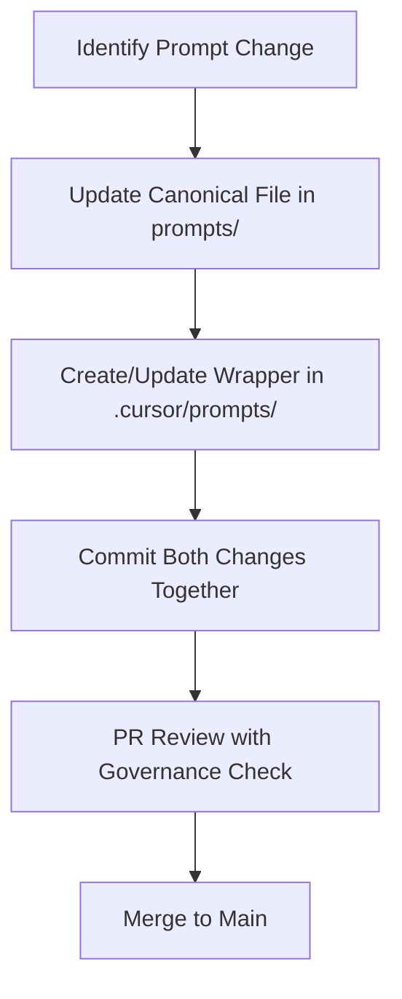

# Prompt Governance and Canonicalization Rules

## Overview

This document establishes the governance framework for agent prompts within the Human Execution Engine (HEE) ecosystem, ensuring consistency, maintainability, and cross-editor compatibility.

## Core Principles

### 1. Canonical Source of Truth

**Rule**: The `prompts/` directory is the **only** authoritative source for all agent prompts.

**Rationale**:
- Ensures editor-agnostic prompt management
- Prevents prompt drift across different environments
- Provides a single source of truth for all agents
- Enables deterministic behavior across human and agent execution

### 2. Editor Integration Discipline

**Rule**: Editor-specific directories (e.g., `.cursor/prompts/`) contain **only** non-canonical wrapper stubs.

**Implementation**:
- `.cursor/prompts/` exists solely for Cursor usability improvements
- Wrapper files must clearly point to canonical sources
- No unique or authoritative instructions in wrapper files

## Change Management Process

### 1. Prompt Modification Workflow



### 2. Mandatory Synchronization Requirements

**Requirements**:
- Any change to `prompts/` **requires** corresponding `.cursor/prompts/` update
- Both changes must be in the **same commit**
- Reviewers must treat synchronization mismatches as blocking issues

**Violation Handling**:
- Short-term: Enforced via agent rules and PR checklists
- Long-term: Automated via pre-commit and CI hooks

### 3. File Naming Convention

**Pattern**: For every `prompts/<filename>.md`, there MUST exist `.cursor/prompts/<filename>.md`

**Wrapper File Requirements**:
1. Must contain clear reference to canonical source
2. Must be safe to overwrite automatically
3. Must contain no unique authoritative content

## Quality Assurance Framework

### 1. Pre-Commit Validation

**Checks**:
- Canonical file exists for every wrapper
- Wrapper references are accurate
- No authoritative content in wrapper files
- File naming consistency

### 2. CI Pipeline Integration

**Automated Checks**:
- Synchronization validation script
- Content drift detection
- Reference integrity verification
- Change discipline enforcement

### 3. Review Process

**Reviewer Responsibilities**:
- Verify canonical/wrapper synchronization
- Ensure no authoritative content in wrappers
- Validate reference accuracy
- Confirm change discipline compliance

## Implementation Examples

### Canonical Prompt Structure

```markdown
# Agent Task Execution Protocol

## Overview
This document defines the execution protocol for HEE agents...

## Core Principles
1. Spec-first development
2. Test-driven implementation
3. Continuous integration discipline
```

### Corresponding Wrapper Stub

```markdown
# Wrapper: Agent Task Execution Protocol

**Canonical Source**: See `prompts/01-architecture-api.md`

This file exists solely for Cursor editor integration. All authoritative content resides in the canonical prompt file.

**Do not edit this file directly** - changes should be made to the canonical source and synchronized.
```

## Governance Enforcement

### 1. Agent Rules

**Agent Responsibilities**:
- Proactively enforce canonicalization rules
- Flag synchronization violations
- Maintain wrapper file hygiene
- Document governance compliance

### 2. Human Reviewer Rules

**Human Responsibilities**:
- Validate canonical/wrapper synchronization
- Reject PRs with governance violations
- Maintain documentation consistency
- Escalate systemic issues

### 3. Automation Rules

**Automation Requirements**:
- Pre-commit hooks for basic validation
- CI scripts for comprehensive checking
- Automated synchronization tools
- Reporting and alerting mechanisms

## Compliance and Reporting

### 1. Violation Classification

| Severity | Description | Handling |
| -------- | ----------- | -------- |
| Critical | Missing canonical/wrapper sync | Block merge, immediate fix |
| Major | Authoritative content in wrapper | Block merge, rewrite required |
| Minor | Reference inaccuracies | Warning, fix in follow-up |

### 2. Reporting Framework

**Metrics**:
- Synchronization compliance rate
- Violation detection rate
- Resolution time
- Recurrence rate

**Reporting**:
- Weekly governance reports
- PR-level compliance status
- Repository health dashboard
- Trend analysis

## Future Enhancements

### 1. Automation Roadmap

- **Phase 1**: Basic pre-commit validation
- **Phase 2**: CI integration with blocking checks
- **Phase 3**: Automated synchronization tools
- **Phase 4**: Self-healing repository mechanisms

### 2. Cross-Editor Support

- VS Code integration patterns
- Neovim/Vim plugin support
- JetBrains IDE integration
- Web-based editor support

## Appendix: Common Patterns and Anti-Patterns

### ✅ Correct Patterns

**Pattern 1**: Synchronized canonical/wrapper pair
```bash
prompts/agent-protocol.md          # Canonical
.cursor/prompts/agent-protocol.md  # Wrapper
```

**Pattern 2**: Clear wrapper reference
```markdown
# Wrapper: Agent Protocol
**Canonical**: prompts/agent-protocol.md
**Purpose**: Cursor integration only
```

### ❌ Anti-Patterns

**Anti-Pattern 1**: Missing wrapper synchronization
```bash
prompts/agent-protocol.md          # Canonical exists
.cursor/prompts/agent-protocol.md  # Wrapper missing
```

**Anti-Pattern 2**: Authoritative content in wrapper
```markdown
# Agent Protocol (WRONG - authoritative content in wrapper)
This is the actual protocol...  # Should be in canonical only
```

**Anti-Pattern 3**: Stale references
```markdown
# Wrapper: Agent Protocol
**Canonical**: prompts/old-name.md  # File was renamed
```

## Integration with HEE Principles

### 1. Spec-First Alignment

- Prompt governance follows spec-first discipline
- Documentation precedes implementation
- Governance rules are specification artifacts

### 2. Quality Discipline

- Governance rules are first-class requirements
- Compliance is gated requirement
- Quality metrics include governance health

### 3. CI Integration

- Governance checks in CI pipeline
- Blocking violations prevent merge
- Automated reporting and enforcement

This governance framework ensures that HEE maintains a consistent, reliable, and maintainable prompt ecosystem across all execution environments and editor integrations.
