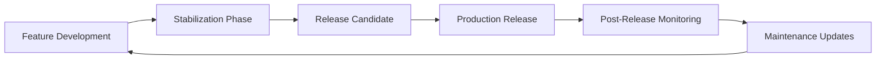

# HEE Release System: Versioning, Packaging, and Deployment

## Overview

This document specifies the comprehensive release system for the Human Execution Engine (HEE) ecosystem, integrating best practices from tick-task's operations framework and adapting them to HEE's architecture and principles.

## Release Philosophy

### 1. Core Principles

**Spec-First Release Discipline**:
- Release specifications precede implementation
- Documentation completeness is a release criterion
- Spec coverage metrics gate release readiness

**Quality-First Approach**:
- 100% test coverage requirement for production releases
- Comprehensive validation before any release
- Rollback capability for all production deployments

**State-Preserving Releases**:
- State capsule integration throughout release process
- Decision preservation across release cycles
- Context stability during version transitions

### 2. Release Lifecycle



## Versioning Strategy

### 1. Semantic Versioning with HEE Extensions

**Format**: `MAJOR.MINOR.PATCH[-PRERELEASE][+BUILD]`

**HEE-Specific Rules**:
- **MAJOR**: Breaking changes to HEE core architecture or state capsule format
- **MINOR**: New features with backward compatibility and state preservation
- **PATCH**: Bug fixes with full state compatibility
- **PRERELEASE**: `alpha`, `beta`, `rc` suffixes with state validation
- **BUILD**: Build metadata with state capsule references

### 2. HEE Version Components

| Component       | Description                          | Example          |
| --------------- | ------------------------------------ | ---------------- |
| Core Version    | Semantic version number              | `1.2.3`          |
| State Version   | State capsule format version         | `state-v2`       |
| Prompt Version  | Canonical prompts version            | `prompts-v17`    |
| Spec Version    | Specification framework version     | `spec-v5`        |

**Full Version Example**: `1.2.3+state-v2+prompts-v17+spec-v5`

## Release Process

### 1. Phase-Based Release Workflow

#### Phase 1: Feature Complete

**Criteria**:
- All planned features implemented
- 100% spec coverage achieved
- State capsule integration complete
- Documentation drafts available

**Deliverables**:
- Feature-complete codebase
- Initial state capsules for release
- Draft release notes
- Preliminary changelog

#### Phase 2: Stabilization

**Activities**:
- Bug fixing and edge case handling
- Performance optimization
- Security hardening
- State capsule validation

**Quality Gates**:
- 100% test coverage (line, branch, function, integration, spec, prompt)
- All CI/CD pipelines passing
- State capsule integrity verified
- Security audit completed

#### Phase 3: Release Candidate

**Process**:
1. Version tagging with state references
2. Release candidate build generation
3. Comprehensive testing (functional, performance, security)
4. State capsule validation and signing

**Success Criteria**:
- No critical bugs found
- All quality metrics met
- State capsules validated and signed
- Documentation finalized

#### Phase 4: Production Release

**Steps**:
1. Final state capsule generation
2. Cryptographic signing of all artifacts
3. Git tag creation with state references
4. GitHub release creation with state capsules
5. Distribution channel updates

**Validation**:
- State capsule integrity checks
- Artifact signature verification
- Dependency validation
- Installation testing

### 2. HEE Release Checklist

- [ ] All acceptance criteria met and tested
- [ ] Performance benchmarks achieved
- [ ] Security review completed with state validation
- [ ] Documentation updated with state capsule references
- [ ] Cross-platform testing completed
- [ ] Installation process verified with state preservation
- [ ] Changelog comprehensive with state transitions
- [ ] State capsules signed and validated
- [ ] Rollback procedures tested
- [ ] Monitoring and alerting configured

## Packaging Strategy

### 1. HEE Distribution Formats

| Format          | Target Platform | HEE Integration |
| --------------- | --------------- | --------------- |
| PyInstaller EXE | Windows         | State capsule embedded |
| macOS App       | macOS           | State capsule bundle |
| Linux AppImage  | Linux           | State capsule included |
| Docker Image    | Container       | State capsule volume |
| Source Archive  | All             | State capsule directory |

### 2. Package Contents

**Standard Package Structure**:
```
hee-release-<version>/
├── bin/                    # Executables
├── lib/                    # Libraries
├── prompts/                # Canonical prompts
├── docs/                   # Documentation
├── STATE_CAPSULES/         # Release state capsules
├── scripts/                # Utility scripts
├── config/                 # Configuration templates
└── LICENSE                 # License information
```

### 3. Size and Performance Targets

| Metric               | Target          | Measurement Method |
| -------------------- | --------------- | ------------------ |
| Package Size         | <50MB compressed | Archive size       |
| Installation Time    | <2 minutes      | Clean system test  |
| Startup Time         | <5 seconds      | Cold start         |
| Memory Usage         | <200MB          | Peak usage         |
| State Load Time      | <1 second       | Capsule loading    |

## Deployment Architecture

### 1. Deployment Modes

#### Local Mode (Default)
- Single-user, localhost-only
- No authentication required
- SQLite database with state capsules
- Automatic updates disabled

#### LAN Mode (Opt-in)
- Network-accessible with authentication
- Token-based security
- State capsule synchronization
- Audit logging enabled

#### Cloud Mode (Future)
- Multi-tenant architecture
- Centralized state management
- Scalable monitoring
- Advanced security features

### 2. Configuration Management

**HEE Configuration Structure**:
```json
{
  "version": "1.0",
  "mode": "local",
  "port": 8000,
  "data_path": "~/.hee/",
  "state_capsules": {
    "enabled": true,
    "path": "docs/STATE_CAPSULES/",
    "auto_save": true,
    "encryption": false
  },
  "security": {
    "lan_mode": false,
    "token_rotation": 90,
    "audit_logging": true
  },
  "performance": {
    "max_memory": 200,
    "timeout": 30,
    "cache_size": 50
  }
}
```

## State Capsule Integration

### 1. Release State Capsules

**Required Capsules**:
- `PRE-RELEASE`: Pre-release state and decisions
- `RELEASE`: Final release state and configuration
- `POST-RELEASE`: Post-release monitoring and issues

**Capsule Structure**:
```yaml
chat: HEE v1.2.3 Release
purpose: Document release state, decisions, and configuration
context:
  - Project: Human Execution Engine v1.2.3
  - Release Type: Minor feature release
  - Status: Release candidate ready
  - Constraints: Backward compatibility required
  - Dependencies: All dependencies validated
  - State Version: state-v2 compatible

decisions:
  - Maintain backward compatibility with v1.1.x and v1.2.x
  - Include new CI monitoring features as opt-in
  - Preserve existing state capsule format
  - Add prompt coverage metrics to monitoring

open_threads:
  - Monitor adoption of new CI features
  - Track performance metrics in production
  - Collect user feedback on state management
  - Plan v2.0.0 breaking changes

next_chat_bootstrap:
  - Monitor initial deployment metrics
  - Address any critical issues immediately
  - Prepare v1.2.4 patch if needed
  - Begin v2.0.0 planning
```

### 2. State Capsule Versioning

**Version Compatibility Matrix**:

| HEE Version | State Version | Compatibility |
| ----------- | ------------- | ------------- |
| 1.0.x       | state-v1      | Full          |
| 1.1.x       | state-v1      | Full          |
| 1.2.x       | state-v2      | Full          |
| 1.2.x       | state-v1      | Read-only     |
| 2.0.x       | state-v3      | Full          |
| 2.0.x       | state-v2      | Migration     |

## Documentation and Changelog Discipline

### 1. HEE Documentation Standards

**Requirements**:
- Versioned documentation with state references
- State capsule integration examples
- Decision rationale preservation
- Migration guides for breaking changes

**Structure**:
```
docs/
├── v1.2/                     # Versioned docs
│   ├── USER_GUIDE.md         # User documentation
│   ├── DEVELOPER_GUIDE.md    # Developer documentation
│   ├── API_REFERENCE.md      # API documentation
│   ├── STATE_CAPSULES/       # Release state capsules
│   └── MIGRATION_GUIDE.md    # Migration instructions
└── latest/                   # Latest docs (symlink)
```

### 2. Changelog Format

**HEE Changelog Structure**:
```markdown
# Changelog

## [1.2.3] - 2026-01-24
### Added
- CI monitoring system with state integration
- Automated error fixing with state preservation
- Prompt coverage metrics

### Changed
- Improved state capsule validation
- Enhanced decision preservation mechanisms

### Fixed
- State corruption issues in edge cases
- Memory leaks in long-running sessions

### Security
- Enhanced state capsule encryption
- Improved token rotation

### State Capsules
- Updated to state-v2 format
- Added release-specific capsules
- Improved validation procedures

### Migration
- Automatic migration from state-v1 to state-v2
- Backward compatibility maintained
- Rollback procedures documented
```

## Quality Assurance Framework

### 1. Release Validation Process

**Validation Stages**:
1. **Spec Validation**: 100% spec coverage verification
2. **State Validation**: State capsule integrity checks
3. **Security Validation**: Vulnerability scanning
4. **Performance Validation**: Benchmark testing
5. **Integration Validation**: Ecosystem compatibility

### 2. HEE Quality Metrics

| Metric                     | Target       | Measurement Method |
| -------------------------- | ------------ | ------------------ |
| Spec Coverage              | 100%         | Automated testing  |
| State Preservation         | 100%         | Capsule validation |
| Test Coverage              | 100%         | Coverage analysis  |
| Security Vulnerabilities   | 0 critical   | Static analysis    |
| Performance Regression     | <5%          | Benchmark comparison |
| State Capsule Integrity    | 100%         | Validation suite   |

## Security and Compliance

### 1. Release Security Requirements

**HEE Security Checklist**:
- [ ] Cryptographic signing of all artifacts
- [ ] State capsule encryption for sensitive data
- [ ] Dependency vulnerability scanning
- [ ] Token rotation configuration
- [ ] Audit logging enabled
- [ ] Security documentation updated

### 2. Compliance Requirements

**HEE Compliance Matrix**:

| Requirement               | Status      | Validation Method |
| ------------------------- | ----------- | ----------------- |
| License compliance        | Required    | Automated scanning |
| Dependency tracking       | Required    | SBOM generation   |
| Security vulnerability    | Required    | CVE database check |
| State capsule integrity   | Required    | Cryptographic validation |
| Release documentation     | Required    | Completeness check |

## Monitoring and Maintenance

### 1. Post-Release Monitoring

**HEE Monitoring Framework**:
- Real-time error tracking with state context
- Performance metric collection
- User feedback analysis
- State capsule health monitoring

**Alert Thresholds**:
- Critical errors: Immediate alert with state capsule
- Performance degradation: 5-minute threshold
- User feedback trends: Daily analysis
- State issues: Immediate alert

### 2. Maintenance Process

**HEE Maintenance Cycle**:
- **Daily**: Health checks and state validation
- **Weekly**: Performance reviews and state updates
- **Monthly**: Security patches and state evolution
- **Quarterly**: Feature updates with state migration

**Patch Release Criteria**:
- Critical bug fixes only
- No new features
- Full backward compatibility
- State capsule preservation

## Rollback and Recovery

### 1. HEE Rollback Procedures

**Rollback Triggers**:
- Critical failures in production
- Security vulnerabilities discovered
- State corruption detected
- Performance degradation >20%

**Rollback Process**:
1. Identify affected version and state
2. Load previous state capsule
3. Validate rollback compatibility
4. Execute rollback with state restoration
5. Verify system integrity
6. Update state capsules with rollback information

### 2. Recovery Procedures

**HEE Recovery Framework**:
- **Immediate Rollback**: Automatic for critical state failures
- **Gradual Rollback**: Phased for complex state issues
- **State Restoration**: Full system state recovery
- **Manual Intervention**: Human review for ambiguous cases

## Future Enhancements

### 1. HEE Release Roadmap

| Version | Features                     | Target Date | State Impact |
| ------- | ---------------------------- | ----------- | ------------ |
| 1.3.0   | Enhanced state management    | 2026-03-15  | Extended     |
| 1.4.0   | Cross-platform improvements  | 2026-04-01  | Enhanced     |
| 2.0.0   | Breaking changes + state-v3  | 2026-06-01  | Transformative |
| 2.1.0   | Cloud deployment support     | 2026-07-15  | Extended     |

### 2. Research Areas

- Automated release generation from specs
- AI-assisted state capsule analysis
- Predictive release quality analysis
- Automated migration tooling

## Integration with HEE Principles

### 1. Spec-First Integration

- Release specs documented before implementation
- State capsule specs precede release planning
- Documentation completeness gated requirement
- Spec coverage metrics for release readiness

### 2. Quality Discipline Integration

- Release quality gates include state validation
- Test coverage requirements for all release types
- Rollback capability mandatory for production
- State preservation requirement for all operations

### 3. CI/CD Integration

- Release validation in CI pipelines
- State capsule checks in pre-commit hooks
- Automated release candidate generation
- Quality gate integration with release process

## Appendix: Release Command Reference

### Release Preparation

```bash
# Generate release state capsule
python scripts/generate_release_capsule.py --version 1.2.3 --type minor

# Validate release readiness
python scripts/validate_release.py --state-capsule release.json --checklist full

# Create release artifacts
python scripts/create_release.py --version 1.2.3 --output dist/
```

### Release Execution

```bash
# Sign release artifacts
python scripts/sign_release.py --input dist/ --key release-key.pem

# Generate release notes
python scripts/generate_release_notes.py --version 1.2.3 --output RELEASE_NOTES.md

# Create GitHub release
gh release create v1.2.3 --notes-file RELEASE_NOTES.md --target main
```

### Post-Release

```bash
# Monitor release health
python scripts/monitor_release.py --version 1.2.3 --state-capsule post-release.json

# Generate post-release report
python scripts/generate_post_release_report.py --version 1.2.3 --output report.md

# Archive release state capsules
python scripts/archive_state_capsules.py --version 1.2.3 --destination archive/
```

This HEE Release System provides a comprehensive framework for versioning, packaging, and deployment that integrates seamlessly with HEE's core principles of spec-first development, quality discipline, and state preservation.
