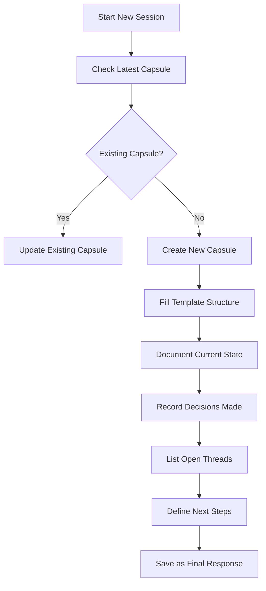
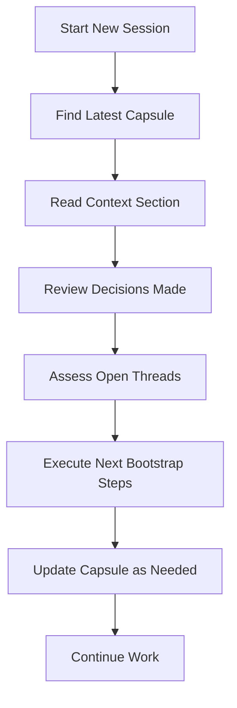

# State Capsules: Structured Context Preservation System

## Overview

State Capsules are structured handoff documents that preserve decision state and context when transitioning between agents, chat sessions, or execution contexts within the Human Execution Engine (HEE) ecosystem.

## Core Concepts

### 1. Purpose and Value Proposition

**Primary Objectives**:
- **Continuation Vector**: Enable seamless handoffs between execution contexts
- **Decision Preservation**: Maintain critical decision state across transitions
- **Context Stability**: Prevent loss of important context and requirements
- **Workflow Efficiency**: Reduce rework and context reconstruction overhead

### 2. When to Use State Capsules

**Mandatory Usage Scenarios**:
- Transitioning between agents or chat sessions
- Preserving complex decision state across interruptions
- Multi-step projects with dependencies and constraints
- Knowledge transfer between team members or agents
- Project phase transitions and milestones

## State Capsule Structure

### 1. Required Components

```yaml
chat: <project-name> <phase/session>
purpose: <one-sentence objective>
context:
  - Project: <project description>
  - Current Phase: <current phase or milestone>
  - Status: <current status and recent progress>
  - Constraints: <important constraints or requirements>
  - Dependencies: <key dependencies or blockers>
  - Tools/Technologies: <key tools, frameworks, or technologies>

decisions:
  - <specific decision made with rationale>
  - <technical choice and why it was chosen>
  - <architectural decision and its impact>
  - <any trade-offs that were considered>

open_threads:
  - <unresolved issue or pending task>
  - <dependency or blocker>
  - <next major milestone>
  - <risk or concern that needs attention>
  - <question that needs answering>

next_chat_bootstrap:
  - <immediate next step to take>
  - <how to continue current work>
  - <what to investigate or implement>
  - <priority order for remaining tasks>
```

### 2. Component Details

#### Chat Identifier
- **Format**: Short, descriptive name
- **Pattern**: `<Project> <Phase/Session>`
- **Example**: `MT-logo-render Phase 3 CI Troubleshooting`

#### Purpose Statement
- **Format**: Single sentence, clear and concise
- **Content**: Objective of the current session
- **Example**: `Document current state and remaining work for Phase 3 completion`

#### Context Section
- **Content Areas**:
  - Project overview and scope
  - Current phase and milestone status
  - Recent progress and achievements
  - Critical constraints and requirements
  - Key dependencies and blockers
  - Tools and technologies in use

#### Decisions Section
- **Content Requirements**:
  - Specific decisions made during session
  - Technical choices with rationale
  - Architectural decisions and impact analysis
  - Trade-offs considered and resolution

#### Open Threads Section
- **Content Requirements**:
  - Unresolved issues and pending tasks
  - Dependencies and external blockers
  - Next major milestones and deliverables
  - Risks and concerns requiring attention
  - Questions needing answers or investigation

#### Next Chat Bootstrap
- **Content Requirements**:
  - Immediate next steps (actionable items)
  - Continuation instructions for current work
  - Investigation and implementation priorities
  - Clear priority ordering

## Implementation Patterns

### 1. Directory Organization

```
docs/STATE_CAPSULES/
├── README.md                    # Directory documentation
├── 2026-01-23/                 # Date-based organization
│   ├── MT-logo-render-Phase3-CI-Troubleshooting.md
│   └── template.md              # Session template
├── 2026-01-24/                 # Next day's capsules
│   └── [next-session-name].md
└── archive/                     # Historical capsules
    ├── 2026-01-20/
    │   └── [older-capsules].md
    └── 2026-01-15/
        └── [older-capsules].md
```

### 2. Naming Conventions

**Date Format**: `YYYY-MM-DD` (ISO 8601)
**File Pattern**: `Project-Session-Description.md`
**Examples**:
- `2026-01-23/MT-logo-render-Phase3-CI-Troubleshooting.md`
- `2026-01-24/HEE-Release-Preparation.md`

## Usage Workflow

### 1. Creation Process



### 2. Continuation Process



## Integration with HEE Systems

### 1. Git Integration

**Best Practices**:
- Version control all State Capsules
- Include capsule references in commit messages
- Link capsules in pull request descriptions
- Use in release notes for major transitions

### 2. CI/CD Integration

**Integration Points**:
- Generate capsule summaries in build artifacts
- Include capsule links in deployment notifications
- Use capsule metadata for project status updates
- Validate capsule structure in documentation checks

### 3. Project Management

**Usage Patterns**:
- Reference in sprint planning and retrospectives
- Use for knowledge transfer during team changes
- Include in project documentation and wikis
- Link to relevant capsules in issue tracking

## Quality Assurance Framework

### 1. Content Validation Checklist

- [ ] Identified current project phase and status
- [ ] Documented all key decisions with rationale
- [ ] Listed all unresolved issues and dependencies
- [ ] Defined clear, actionable next steps
- [ ] Used specific, unambiguous language
- [ ] Included rationale for important decisions
- [ ] Prioritized open threads by importance
- [ ] Made next steps immediately actionable

### 2. Structural Validation

**Requirements**:
- All required sections present and non-empty
- YAML format compliance
- Consistent naming conventions
- Accurate date and project references
- Proper file organization

## Advanced Patterns

### 1. Multi-Agent Collaboration

**Pattern**: Chain of State Capsules
```
Agent A → State Capsule 1 → Agent B → State Capsule 2 → Agent C
```

**Benefits**:
- Preserves context across agent transitions
- Enables specialization and handoffs
- Maintains decision continuity
- Reduces context reconstruction overhead

### 2. Long-Running Projects

**Pattern**: Milestone-Based Capsules
```
Phase 1 Capsule → Phase 2 Capsule → Phase 3 Capsule → Release Capsule
```

**Benefits**:
- Clear phase boundaries and transitions
- Progress tracking and visibility
- Decision history preservation
- Risk and dependency tracking

### 3. Cross-Project Integration

**Pattern**: Project Ecosystem Capsules
```
Project A Capsule → Integration Capsule → Project B Capsule
```

**Benefits**:
- Cross-project context preservation
- Dependency management
- Integration point documentation
- Ecosystem-wide decision tracking

## Best Practices and Anti-Patterns

### ✅ Best Practices

**Practice 1**: Specific and Actionable
```yaml
next_chat_bootstrap:
  - Fix HEE Security Scan job failures
  - Update mdformat to version 0.7.19
  - Verify all CI jobs pass after changes
```

**Practice 2**: Decision Rationale
```yaml
decisions:
  - Use cargo fmt --all before pushes to prevent formatting failures
  - Rationale: Prevents CI failures due to inconsistent formatting
```

### ❌ Anti-Patterns

**Anti-Pattern 1**: Vague Next Steps
```yaml
next_chat_bootstrap:
  - Continue working on the project  # Too vague
```

**Anti-Pattern 2**: Missing Context
```yaml
context:
  - Project: Some project  # Too generic
```

**Anti-Pattern 3**: Empty Sections
```yaml
open_threads:
  -  # Missing content
```

## Implementation Tools

### 1. Template Management

**Template Location**: `docs/TEMPLATES/STATE_CAPSULE_TEMPLATE.md`

**Usage**:
```bash
# Create new capsule from template
cp docs/TEMPLATES/STATE_CAPSULE_TEMPLATE.md docs/STATE_CAPSULES/$(date +%Y-%m-%d)/New-Session.md
```

### 2. Directory Management

**Automation Scripts**:
```bash
# Create date directory if needed
mkdir -p docs/STATE_CAPSULES/$(date +%Y-%m-%d)

# Find latest capsule
LATEST=$(ls -dt docs/STATE_CAPSULES/*/ | head -1)/*.md
```

## Integration with HEE Principles

### 1. Spec-First Alignment

- State Capsules document specification decisions
- Preserve architectural rationale
- Maintain decision history for future reference

### 2. Quality Discipline

- Structured format ensures content quality
- Validation checklist maintains standards
- Review process includes capsule validation

### 3. CI Integration

- Capsule validation in documentation checks
- Structure validation in pre-commit hooks
- Quality gates include capsule compliance

## Future Enhancements

### 1. Automation Roadmap

- **Phase 1**: Template validation scripts
- **Phase 2**: Automated capsule generation
- **Phase 3**: Integration with project tracking
- **Phase 4**: AI-assisted capsule analysis

### 2. Advanced Features

- Capsule versioning and diffing
- Cross-reference linking
- Automated dependency tracking
- Integration with knowledge bases

This State Capsule system provides HEE with a robust framework for context preservation, decision tracking, and seamless execution handoffs across agents and sessions.
